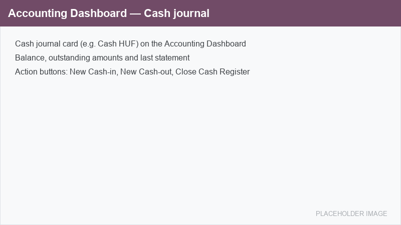

=============
Cash register
=============

The **Cash register** (*Házipénztár*) turns an Odoo cash journal into a Hungarian
strict-accountability (*szigorú számadás*) cash book. It adds gap-free numbered cash-in and
cash-out vouchers, serially numbered cash-book statements (*kivonat*), an amount spelled out in
words on every voucher, and protection against back-dating.

The module builds on standard Odoo :ref:`cash journals <accounting/journals/cash>` and the
:guilabel:`Accounting Dashboard`; it does not replace them, it extends them with the controls a
serially-numbered, audit-proof cash book requires.

Key features
============

- **Four no-gap numbering sequences per cash journal**: one for the journal entries, one for the
  cash-book statements (``STAT``), and one each for cash-in (``BEF``) and cash-out (``KIF``)
  vouchers.
- **Numbered cash vouchers**: every posted cash-in or cash-out movement receives a continuous,
  per-year number and an amount written out in words (*betűs összeg*).
- **Cash-book statements**: a cash-book page can be opened and later confirmed (locked); the
  ``STAT`` number is assigned only on confirmation, so an open page never burns a number.
- **Back-dating protection**: a voucher cannot be dated earlier than the last already-numbered
  voucher, keeping the numbering and the dates monotonic.
- **Cash count on closing**: the drawer can be counted by denomination and closed with an automatic
  discrepancy check.

.. note::
   The Cash register is an *eYssen* extension for Hungarian localization. Once the cash journals are
   configured, day-to-day operations (vouchers, statements, closing) are handled from the
   :guilabel:`Accounting Dashboard`.

.. toctree::
   :titlesonly:

   cash_register/configuration
   cash_register/operations
