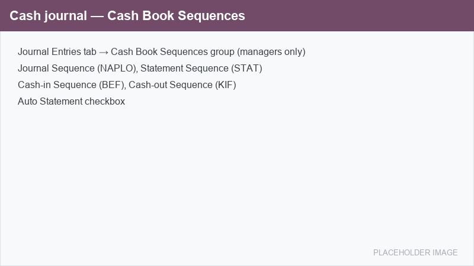

=============
Configuration
=============

Installation
============

Navigate to :menuselection:`Apps`, search for **Cash Register**, and click :guilabel:`Install`. The
module depends on :guilabel:`Accounting`; on a Hungarian localization database it is usually
installed together with the localization.

.. important::
   Configuring the numbering sequences is restricted to users in the
   :guilabel:`Billing Administrator` (*Főkönyvelő*) group. Cashiers do not need access to the
   configuration to record vouchers.

Set up a cash journal
=====================

Each physical cash desk is a separate cash journal, one per currency (for example *Cash HUF*,
*Cash EUR*). To create one, go to :menuselection:`Accounting --> Configuration --> Journals`, click
:guilabel:`New`, and set the :guilabel:`Type` to :guilabel:`Cash`.

On a cash journal, the :guilabel:`Journal Entries` tab shows an extra **Cash Book Sequences** group
where the four numbering sequences and the auto-statement option are assigned.

Numbering sequences
===================

The module ships four ready-made :guilabel:`No gap` sequences that you assign on each cash journal.
A *no-gap* sequence guarantees a continuous, audit-proof numbering as required by Hungarian strict
accountability, and each sequence restarts every year.

.. list-table::
   :header-rows: 1
   :widths: 30 20 50

   * - Field
     - Prefix
     - Purpose
   * - :guilabel:`Journal Sequence`
     - ``NAPLO/``
     - Numbers the journal entries of this cash journal.
   * - :guilabel:`Statement Sequence`
     - ``STAT/``
     - Assigned to each cash-book statement when it is confirmed (*kivonat sorszám*).
   * - :guilabel:`Cash-in Sequence`
     - ``BEF/``
     - Numbers inbound cash vouchers (*befizetés sorszám*).
   * - :guilabel:`Cash-out Sequence`
     - ``KIF/``
     - Numbers outbound cash vouchers (*kifizetés sorszám*).

.. tip::
   You can assign the **same** sequence to :guilabel:`Cash-in Sequence` and
   :guilabel:`Cash-out Sequence` to keep a single running number across both directions, or assign
   **two different** sequences to number each direction separately. This choice also widens or
   narrows the scope of the back-dating check (see :ref:`cash_register/back-dating`).

To create your own sequences, duplicate the supplied templates in
:menuselection:`Settings --> Technical --> Sequences & Identifiers --> Sequences`, keep the
:guilabel:`Implementation` set to :guilabel:`No gap`, and select them on the journal. The running
number is never reset by a module upgrade.

Auto statement
==============

Enable :guilabel:`Auto Statement` on the journal so that posting a cash voucher automatically opens
or attaches a cash-book statement when none is open. Leave it disabled to open the cash-book pages
manually.

.. _cash_register/back-dating:

Back-dating protection
======================

By default the cash book is protected against back-dating: a voucher cannot be posted with a date
earlier than the last already-numbered voucher in its numbering scope. This keeps the numbering and
the dates monotonic, as required for a strict-accountability cash book.

An administrator can lift this restriction by setting the system parameter
``eyssen_cashregister.override_sequence_date_constraint`` to ``1`` in
:menuselection:`Settings --> Technical --> System Parameters`. The default value ``0`` keeps the
protection active.
