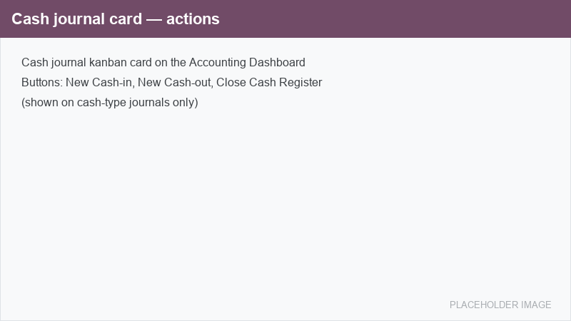
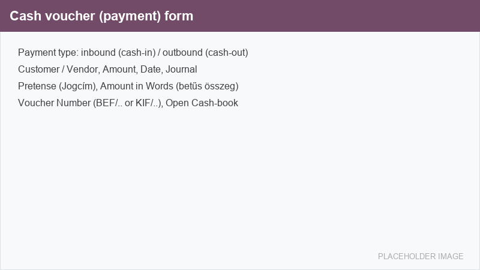
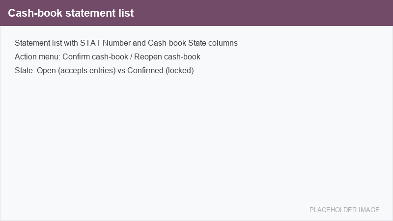
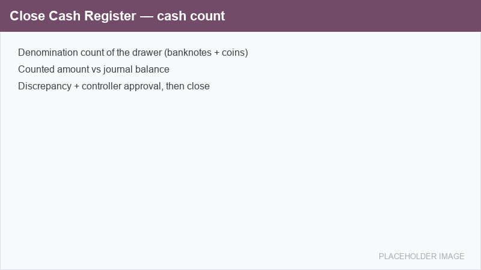

==========
Operations
==========

Day-to-day cash handling is done from the :guilabel:`Accounting Dashboard`. On a cash journal card,
the cash-register actions are available next to the standard buttons.

Record a cash-in or cash-out voucher
====================================

#. On the cash journal card, click :guilabel:`New Cash-in` for money received, or
   :guilabel:`New Cash-out` for money paid out. A cash voucher form opens with the journal and the
   direction already filled in.
#. Select the :guilabel:`Customer` or :guilabel:`Vendor` and enter the :guilabel:`Amount`.
#. Fill in the cash-specific fields:

   - :guilabel:`Pretense` (*Jogcím*): the reason for the cash movement. It is editable only while
     the voucher is a draft.
   - :guilabel:`Date`: the voucher date. It may not be earlier than the last numbered voucher (see
     :ref:`cash_register/back-dating`).

#. Confirm the voucher. On posting:

   - It receives the next gap-free number from the journal's :guilabel:`Cash-in Sequence` or
     :guilabel:`Cash-out Sequence` (for example ``BEF/2026/00012`` or ``KIF/2026/00007``), shown in
     :guilabel:`Voucher Number`.
   - The :guilabel:`Amount in Words` (*betűs összeg*) is filled in automatically for the printed
     voucher.

.. note::
   A draft voucher that is cancelled never consumes a number, so the numbering stays gap-free. Once
   a voucher carries a number it can no longer be deleted, which preserves the audit trail.

Cash-book statements
====================

A cash-book statement (*pénztárkönyv / kivonat*) is a numbered page that groups a period's cash
movements. A statement is **Open** while it accepts entries and **Confirmed** once it is closed and
locked.

Confirm a cash book
-------------------

When a cash-book page is complete, select it in the statement list and choose
:menuselection:`Action --> Confirm cash-book`. On confirmation:

- The statement receives the next gap-free :guilabel:`STAT Number` from the journal's
  :guilabel:`Statement Sequence` (for example ``STAT/2026/00013``). Because the number is assigned
  only on confirmation, an open page never burns a ``STAT`` number.
- The :guilabel:`Cash-book State` changes to :guilabel:`Confirmed`, and the page and its number can
  no longer be altered.

Reopen a cash book
------------------

A confirmed cash book can be reopened with :menuselection:`Action --> Reopen cash-book`. This action
is restricted to the :guilabel:`Billing Administrator` (*Főkönyvelő*) group. Reopening keeps the
existing ``STAT`` number — a cash book is never re-numbered — and is recorded in the chatter.

Close and count the cash drawer
===============================

To reconcile the physical cash on hand, click :guilabel:`Close Cash Register` on the cash journal
card. Count the drawer by denomination; the system compares the counted amount with the journal
balance and reports any discrepancy. A controller can review and approve a discrepancy before the
count is closed.

