====
Sign
====

**eYssen Sign** allows you to send, sign, and approve documents online using electronic signatures.
It provides a complete document signing solution with PDF template management, a drag-and-drop field
editor, multi-party signing workflows, two-factor authentication, a full audit trail, and
integrations with sales, invoicing, and HR.

An **electronic signature** shows a person's agreement to the content of a document. Just like a
handwritten signature, the electronic one represents a legal binding by the terms of the signed
document.

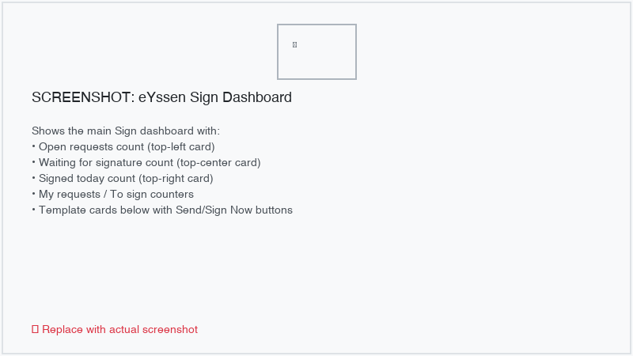

Validity of electronic signatures
=================================

Documents signed via the Sign app are valid electronic signatures in the European Union and the
United States of America. They also meet the requirements for electronic signatures in most
countries. The legal validity of electronic signatures generated by eYssen Sign depends on your
country's legislation. Companies doing business abroad should also consider other countries'
electronic signature laws.

.. important::
   The information below has no legal value; it is only provided for general informational purposes.
   As laws governing electronic signatures rapidly evolve, we cannot guarantee that all information
   is up-to-date. We advise contacting a local attorney for legal advice regarding electronic
   signature compliance and validity.

European Union
--------------

The `eIDAS regulation <http://data.europa.eu/eli/reg/2014/910/oj>`_ establishes the framework for
electronic signatures in the `27 member states of the European Union
<https://europa.eu/european-union/about-eu/countries_en>`_. It distinguishes three types of
electronic signatures:

#. Simple electronic signatures
#. Advanced electronic signatures
#. Qualified electronic signatures

eYssen Sign generates the first type, **simple electronic signatures**; these signatures are legally
valid in the EU, as stated in the eIDAS regulation.

Electronic signatures may not be automatically recognized as valid. You may need to bring supporting
evidence of a signature's validity. The Sign app automatically collects supporting evidence during
the signing process, such as:

#. Email and SMS verification (if enabled)
#. Timestamped, IP-tracked, and geographically traceable access logs to the documents and their
   associated signatures
#. Document traceability and inalterability (any alteration made to a signed document is detected
   using cryptographic hash chains)

United States of America
------------------------

The `ESIGN Act (Electronic Signatures in Global and National Commerce Act)
<https://www.fdic.gov/regulations/compliance/manual/10/X-3.1.pdf>`_, at the interstate and
international levels, and the `UETA (Uniform Electronic Transactions Act)
<https://www.uniformlaws.org/committees/community-home/librarydocuments?communitykey=2c04b76c-2b7d-4399-977e-d5876ba7e034&tab=librarydocuments>`_,
at the state level, provide the legal framework for electronic signatures.

Overall, to be recognized as valid, electronic signatures have to meet five criteria:

#. The signer must show a clear **intent to sign**. For example, using a mouse to draw a signature
   can show intent. The signer must also have the option to opt out of the electronic document.
#. The signer must first express or imply their **consent to conduct business electronically**.
#. **The signature must be clearly attributed**. In eYssen Sign, metadata such as the signer's IP
   address and geolocation is added to the signature, which can be used as supporting evidence.
#. **The signature must be associated with the signed document**, for example, by keeping a record
   detailing how the signature was captured.
#. Electronically signed documents need to be **retained and stored** by all parties involved; for
   example, by providing the signer either a fully-executed copy or the possibility to download a
   copy.

.. _sign/dashboard:

Dashboard
=========

The Sign dashboard is the first screen displayed when you open the app. It is built as an OWL
component and provides an at-a-glance overview of your signing activity along with quick access to
your templates.

Statistics
----------

At the top of the dashboard, a set of counters displays real-time signing metrics:

- **Open Requests**: total number of signing requests that are still in progress (state *Sent*).
- **Waiting for Others**: requests where you are *not* a pending signer but other participants have
  not yet signed.
- **Signed Today**: number of requests that reached the *Signed* state today.
- **My Requests**: requests you created.
- **To Sign**: requests where you are a pending signer.

Template cards
--------------

Below the statistics, your templates are displayed as cards. Each card shows the template name,
category, and tags. Two action buttons are available on each card:

- :guilabel:`Send`: opens the send wizard to create a new signing request from this template and
  assign signers to the defined roles.
- :guilabel:`Sign Now`: starts a signing session immediately where you, as the current user, fill in
  all roles yourself. This is useful for internal documents that only require one signature.

You can **star or unstar** templates to mark them as favorites. Favorite templates are shown first on
the dashboard.

.. _sign/templates:

Templates
=========

Templates are reusable PDF documents with pre-configured signing fields. Go to
:menuselection:`Sign --> Templates` to view, create, and manage your templates.

Creating a template
-------------------

To create a new template:

#. Click :guilabel:`Upload a PDF Template` from the dashboard, or go to
   :menuselection:`Sign --> Templates` and click :guilabel:`New`.
#. Select a PDF file from your computer.
#. The template editor opens, allowing you to place signing fields on the document.

.. _sign/template-editor:

Template editor
---------------

The template editor provides a visual, drag-and-drop interface for placing fields onto the pages
of your PDF document.

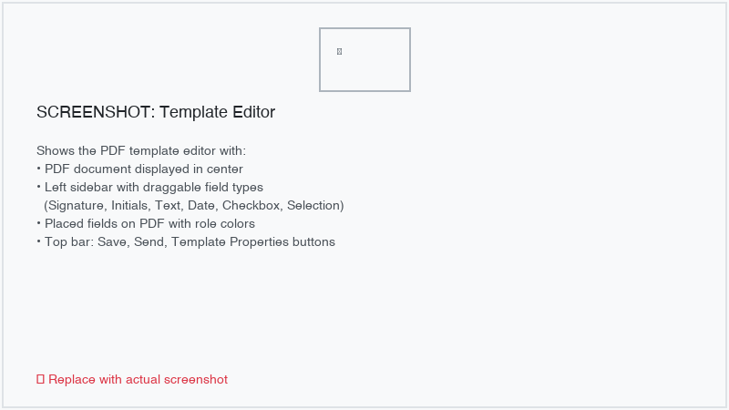

The left sidebar lists all available :ref:`field types <sign/field-types>`. Drag a field from the
sidebar and drop it onto the desired location on the PDF. Once placed, you can:

- **Resize** the field by dragging its corners.
- **Move** the field to a different position on the page.
- **Change the role** assigned to the field by clicking on it and selecting a different role from the
  dropdown.
- **Mark as required** to force signers to fill in the field before completing their signature.
- **Delete** the field by selecting it and pressing the delete key or clicking the trash icon.

Each field is color-coded according to the :ref:`role <sign/roles>` it is assigned to, making it
easy to see which signer is responsible for which fields.

.. tip::
   Use the page navigation controls at the bottom of the editor to move between pages of a
   multi-page PDF document.

PDF rotation
~~~~~~~~~~~~

If your PDF pages are not oriented correctly, you can rotate them directly in the template editor.
Click the rotation button in the toolbar to rotate the current page by 90 degrees.

.. _sign/template-properties:

Template properties
-------------------

Click :guilabel:`Template Properties` in the template editor to configure additional settings.

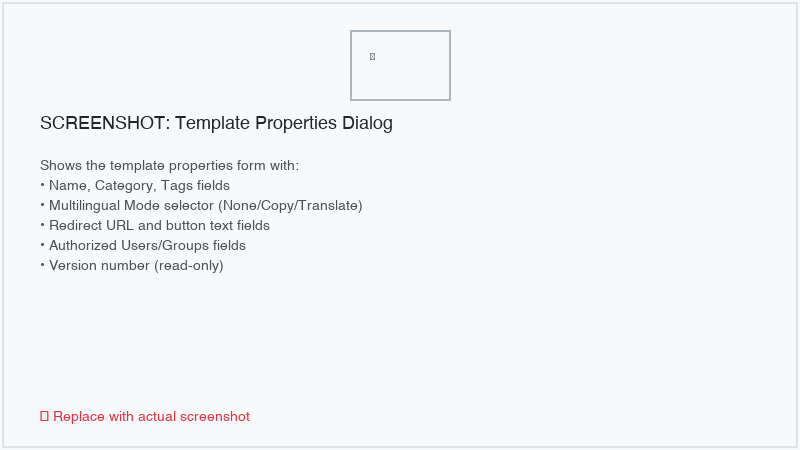

The following properties are available:

- :guilabel:`Name`: the display name of the template.
- :guilabel:`Category`: assign a category for organizational purposes.
- :guilabel:`Tags`: add one or more tags for filtering and searching.
- :guilabel:`Redirect URL`: a URL the signer is redirected to after completing their signature. This
  link also appears in the signature confirmation email.
- :guilabel:`Authorized Users`: restrict which users can use this template. Leave empty to allow all
  Sign users.
- :guilabel:`Authorized Groups`: restrict template access to members of specific security groups.

.. _sign/versions:

Version management
------------------

eYssen Sign tracks template versions automatically. When you need to update a template (for example,
to change the PDF or modify field placement), you can create a new version instead of editing the
current one. This preserves the integrity of existing signing requests that reference earlier
versions.

To create a new version:

#. Open the template and click :guilabel:`Create New Version`.
#. Upload the updated PDF or make changes to the field layout.
#. Save the new version. The previous version is automatically archived.

Existing signing requests continue to reference the version of the template that was current when
they were created.

Version comparison
~~~~~~~~~~~~~~~~~~

You can compare two versions of a template side by side to see what changed. Open a template and
click :guilabel:`Compare Versions`. The comparison view highlights:

- **Added fields**: fields present in the new version but not in the old one (shown in green).
- **Removed fields**: fields present in the old version but not in the new one (shown in red).
- **Modified fields**: fields whose position, size, or properties changed between versions (shown in
  yellow).

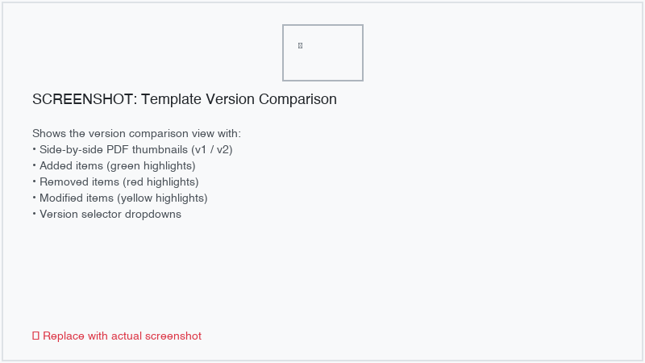

.. _sign/multilingual:

Multilingual support
--------------------

eYssen Sign supports two approaches for handling documents in multiple languages:

**Mode A: Template Copy per Language**

Create a separate PDF document for each language. Each copy is linked to the parent template and
associated with a specific language. When sending a request, the system selects the appropriate
language copy based on the recipient's preferred language.

To set up:

#. Open the template and set :guilabel:`Multilingual Mode` to :guilabel:`Template Copy per
   Language`.
#. Create child template copies for each language by clicking :guilabel:`Create Language Copy`.
#. Upload the localized PDF and configure the fields for each copy.

**Mode B: Dynamic Field Translation**

Use Odoo's built-in translation system to translate field default values and placeholder text. The
PDF itself remains the same, but text fields are populated in the signer's language.

To set up:

#. Open the template and set :guilabel:`Multilingual Mode` to :guilabel:`Dynamic Field
   Translation`.
#. Switch to the desired language using the language selector and translate the default values of
   text fields.

.. note::
   Mode B works best for templates where the PDF content is language-neutral (e.g., forms with
   labeled boxes) and only the field values need translation.

.. _sign/favorites:

Favorites
---------

Star a template to mark it as a favorite. Favorite templates appear first on the dashboard. Click
the star icon on a template card or inside the template form view to toggle the favorite status.

.. _sign/share-link:

Share link
----------

Generate a public URL that allows anyone to sign a document without requiring an Odoo account.

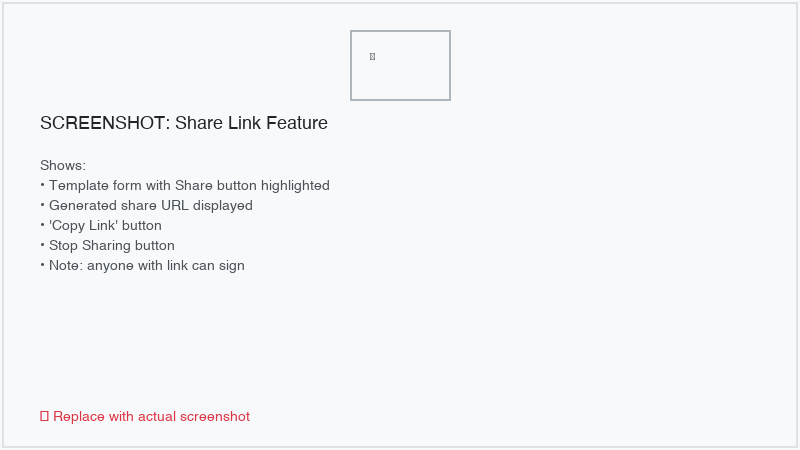

To generate a share link:

#. Open the template.
#. Click :guilabel:`Share`.
#. Copy the generated URL and distribute it via email, chat, or any other channel.

When someone opens the link, they can fill in their details and sign the document. A new signing
request is automatically created for each person who signs via the shared link.

.. note::
   Share links can be deactivated at any time by clicking :guilabel:`Disable Link` on the template.

.. _sign/roles:

Roles
-----

Each field in a Sign document is assigned to a **role** that corresponds to a specific signer. When
a document is sent for signing, each role is mapped to a person who must fill in the fields assigned
to their role.

Roles are managed at :menuselection:`Sign --> Configuration --> Roles`.

You can create new roles or edit existing ones. Each role has:

- :guilabel:`Role Name`: a descriptive name (e.g., *Customer*, *Employee*, *Witness*).
- :guilabel:`Color`: a color used to visually distinguish fields belonging to this role in the
  template editor.
- :guilabel:`Sequence`: determines the default order when multiple roles exist.

.. _sign/field-types:

Field types
-----------

Fields define the type of information signers must provide. The following field types are available:

- :guilabel:`Signature`: the signer draws, auto-generates, or uploads their signature. Subsequent
  signature fields automatically reuse the first signature entered.
- :guilabel:`Initials`: similar to signature, but for the signer's initials.
- :guilabel:`Text`: a single-line text input.
- :guilabel:`Multiline Text`: a multi-line text area for longer content.
- :guilabel:`Checkbox`: a tick box (e.g., for consent or approval).
- :guilabel:`Selection`: a dropdown allowing the signer to choose one option from a predefined list.
- :guilabel:`Date`: a date picker field.

To manage field types, go to :menuselection:`Sign --> Configuration --> Settings --> Edit field
types`.

Auto-fill from partner data
~~~~~~~~~~~~~~~~~~~~~~~~~~~~

Each field type can be configured with an :guilabel:`Auto-fill Partner Field` that automatically
populates the field with data from the signer's contact record (``res.partner``). For example,
setting the auto-fill field to ``email`` pre-fills the field with the signer's email address.

.. tip::
   To find the technical name of a contact field, enable developer mode and hover over the
   question mark icon next to the field on the contact form.

.. note::
   Auto-filled values are suggestions only. The signer can modify them before completing the
   signature.

Field sizing
~~~~~~~~~~~~

The size of fields can be adjusted by editing the :guilabel:`Default Width` and :guilabel:`Default
Height`. Both values are expressed as a percentage of the full page (decimal format), where ``1``
equals the full page width or height. For example, ``0.150`` means 15% of the page width.

.. _sign/requests:

Sign requests
=============

A sign request represents a specific document sent to one or more signers for their signature. Go
to :menuselection:`Sign --> Documents` to view all signing requests.

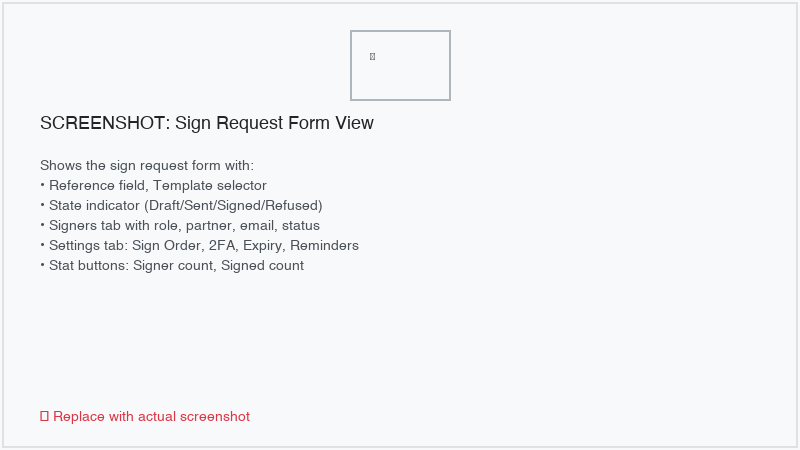

Creating a request
------------------

To create a new signing request:

#. From the dashboard, click :guilabel:`Send` on a template card. Alternatively, go to
   :menuselection:`Sign --> Documents` and click :guilabel:`New`.
#. Select the template to use.
#. In the send wizard, assign a contact to each role defined in the template.

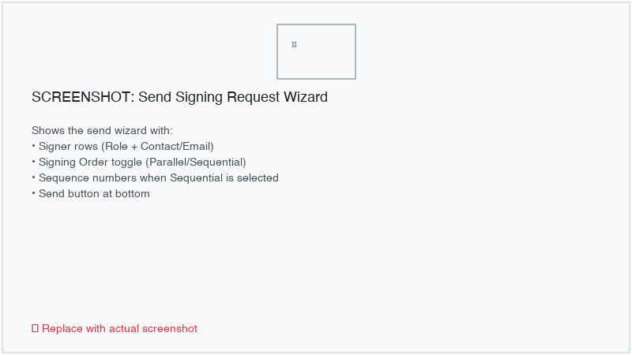

Signing order
-------------

Choose how signers receive the document:

- :guilabel:`Parallel`: all signers receive the document simultaneously and can sign in any order.
- :guilabel:`Sequential`: signers receive the document one at a time, in the order you define. Each
  signer receives the document only after the previous one has completed their part.

For sequential signing, set the order number for each signer in the send wizard.

.. _sign/states:

State machine
-------------

Every sign request follows a defined lifecycle:

#. **Draft**: the request has been created but not yet sent.
#. **Sent**: the request has been sent to the signers.
#. **Signed**: all signers have completed their signatures.
#. **Refused**: one or more signers refused to sign the document.
#. **Canceled**: the request was canceled by the creator.
#. **Expired**: the request's expiry date has passed without all signatures being collected.

.. note::
   Terminal states (*Signed*, *Refused*, *Canceled*, *Expired*) cannot be reversed. This ensures
   the integrity of the audit trail.

.. _sign/2fa:

Two-factor authentication (2FA)
-------------------------------

For additional security, you can require signers to verify their identity with a one-time password
(OTP) before completing their signature.

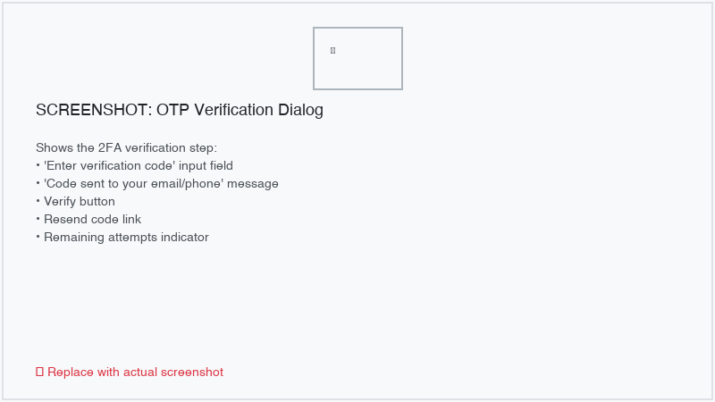

To enable 2FA on a request:

#. In the send wizard, enable :guilabel:`Require 2FA`.
#. Select the verification method:

   - :guilabel:`Email`: a 6-digit code is sent to the signer's email address.
   - :guilabel:`SMS`: a 6-digit code is sent via SMS to the signer's mobile number.
   - :guilabel:`Email & SMS`: codes are sent via both channels; both must be verified.

The OTP code is valid for **10 minutes**. The signer has **3 attempts** to enter the correct code.
After 3 failed attempts, a **15-minute lockout** period is enforced before a new code can be
requested.

.. note::
   SMS verification requires SMS credits. You can purchase credits at
   :menuselection:`Sign --> Configuration --> Settings` under the :guilabel:`SMS` section.

Expiry date
-----------

Set an expiry date on a request to enforce a deadline. If all signatures are not collected by the
expiry date, the request automatically moves to the *Expired* state. A scheduled action (cron job)
runs periodically to check and expire overdue requests.

Reminders
---------

Enable automatic reminders to nudge signers who have not yet completed their part. In the send
wizard, set the :guilabel:`Reminder Frequency` (in days). The system sends periodic email reminders
to pending signers at the specified interval.

Escalation
----------

Set an :guilabel:`Escalation Before Expiry` value (in days) to notify the request creator a
specified number of days before the expiry date. This gives the creator time to follow up with
pending signers or extend the deadline.

Language selection
------------------

Select a :guilabel:`Language` on the request to control the language used in email notifications
sent to signers. If the template uses the *Template Copy per Language* multilingual mode, the
matching language copy of the template is used automatically.

Cancel and refuse
-----------------

- **Cancel**: the request creator can cancel a request at any time while it is in the *Sent* state.
  All pending signers are notified of the cancellation.
- **Refuse**: any signer can refuse to sign. The request moves to the *Refused* state, and all
  participants (including the creator) are notified.

.. _sign/portal:

Signing portal
==============

The signing portal is the public-facing interface where signers review and sign documents. It is
accessible at ``/sign/<token>``, where ``<token>`` is a unique, secure access token generated for
each signer.

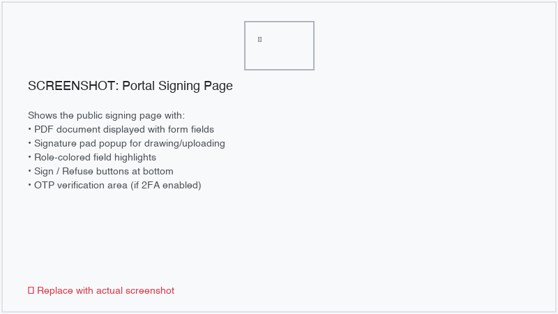

PDF viewer
----------

The signing portal displays the PDF document with interactive fields highlighted for the current
signer. Fields belonging to the signer's role are editable; fields assigned to other roles are
visible but read-only.

Signature capture
-----------------

When the signer reaches a signature or initials field, they can:

- **Draw**: use the mouse or a touchscreen to draw their signature.
- **Auto-generate**: the system generates a signature based on the signer's name.
- **Upload**: upload an image file containing the signature.

If the signer has previously saved a signature on their partner record, it is offered as a
quick-select option for reuse.

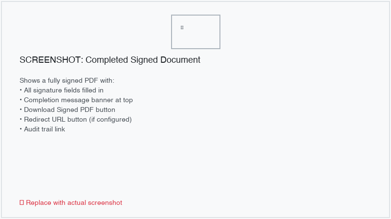

OTP verification step
---------------------

If 2FA is enabled on the request, the signer is prompted to enter a one-time verification code
before their signature is finalized. See :ref:`sign/2fa` for details on the verification process.

Refuse option
-------------

Signers can refuse to sign by clicking :guilabel:`Refuse to Sign`. A notification is sent to the
request creator and all other participants. The request moves to the *Refused* state.

Redirect after signing
----------------------

If a :guilabel:`Redirect URL` is configured on the template, the signer is redirected to that URL
after successfully completing their signature.

Terms & conditions
------------------

If the company has configured Terms & Conditions in the Sign settings, they are displayed to the
signer before they finalize their signature. The signer must accept the terms to proceed.

Geolocation capture
-------------------

With the signer's consent, the portal captures the signer's geographic location (latitude and
longitude) at the time of signing. This data is recorded in the audit log as additional evidence
of the signing event.

QR code
-------

A QR code can be generated for a signing URL, allowing signers to quickly access the signing portal
on a mobile device by scanning the code.

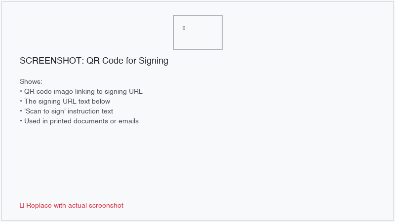

.. _sign/my-signatures:

Portal — My Signatures
======================

Signers who have an Odoo portal account can access a list of all their signing requests at
``/my/sign``.

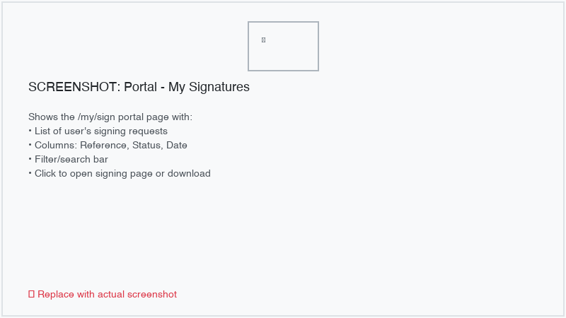

The portal page displays:

- **Reference**: the name of the signing request.
- **Status**: the current state of the request (*Sent*, *Signed*, *Refused*, etc.).
- **Date**: when the request was created.
- **Download**: a link to download the completed signed PDF (available once fully signed).

.. _sign/workflows:

Workflows
=========

The workflow engine allows you to define complex signing and approval processes using a visual graph
builder. Go to :menuselection:`Sign --> Configuration --> Workflows` to manage workflows.

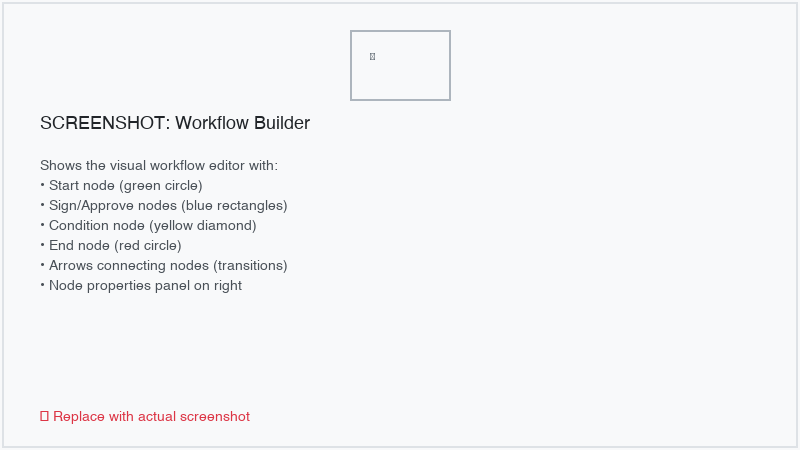

Creating a workflow
-------------------

#. Click :guilabel:`New` to create a new workflow.
#. Enter a :guilabel:`Name` and optionally link a default :guilabel:`Sign Template`.
#. Click :guilabel:`Open Builder` to launch the visual workflow builder.

Node types
----------

The following node types are available:

- :guilabel:`Start`: the entry point of the workflow. Each workflow can have at most one Start node.
- :guilabel:`Signature`: a signing step. Assign a role to define which signer must act at this step.
- :guilabel:`Approval`: an approval step that does not require a signature but requires explicit
  approval from the assigned role.
- :guilabel:`Condition`: a branching node that evaluates a condition and routes the workflow
  accordingly.
- :guilabel:`End`: the terminal node. Each workflow can have at most one End node.

Transitions
-----------

Transitions connect nodes and define the flow of the process. Each transition can have:

- A :guilabel:`Label` (e.g., *Yes*, *No*) displayed on the connection line.
- A :guilabel:`Condition` expression used with Condition nodes to determine the path.

Condition evaluation
--------------------

Condition nodes evaluate expressions based on:

- **Signer state**: check whether a specific signer has completed or refused their part.
- **Field value comparison**: compare the value entered in a specific field against an expected
  value.

When a signer completes their step, the workflow engine automatically advances to the next node
based on the transition rules and condition evaluations.

Using a workflow on a request
-----------------------------

When creating a signing request, select a :guilabel:`Workflow` to govern the process. The request
follows the workflow graph instead of simple parallel or sequential signing. The
:guilabel:`Current Node` field on the request shows which step is currently active.

.. _sign/bulk-send:

Bulk send
=========

Send the same template to multiple recipients at once using the bulk send feature.

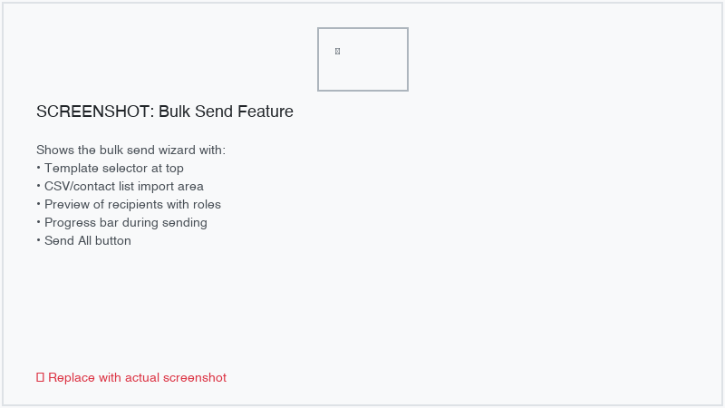

To perform a bulk send:

#. Go to :menuselection:`Sign --> Templates`, select a template, and click :guilabel:`Bulk Send`.
#. In the wizard, add recipients by:

   - Selecting contacts from the database.
   - Importing a CSV file with contact information.

#. Review the list and click :guilabel:`Send All`.

A separate signing request is created for each recipient. You can track the progress of all requests
from the bulk send record. The bulk send view shows:

- Total number of requests created.
- How many have been signed, are pending, or have been refused.

.. _sign/webhooks:

Webhooks
========

Webhooks allow you to notify external systems when signing events occur. Go to
:menuselection:`Sign --> Configuration --> Webhooks` to configure webhook endpoints.

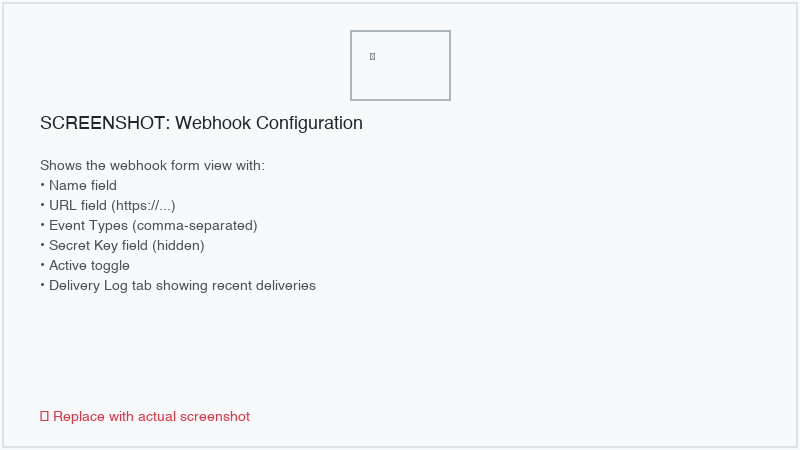

Configuration
-------------

Create a new webhook with the following settings:

- :guilabel:`Name`: a descriptive name for this webhook.
- :guilabel:`URL`: the endpoint URL to which event payloads are delivered.
- :guilabel:`Secret Key`: a shared secret used to sign payloads with HMAC-SHA256. The receiving
  system should verify the signature to ensure payload integrity.
- :guilabel:`Events`: select one or more events to subscribe to.

Available events
----------------

.. list-table::
   :header-rows: 1
   :widths: 30 70

   * - Event
     - Description
   * - ``request_sent``
     - A signing request has been sent to its signers.
   * - ``signer_completed``
     - An individual signer has completed their part.
   * - ``request_signed``
     - All signers have signed; the request is fully completed.
   * - ``request_refused``
     - A signer has refused to sign the document.
   * - ``request_expired``
     - The request has expired past its expiry date.
   * - ``request_canceled``
     - The request has been canceled by its creator.

Payload signing
---------------

Each webhook delivery includes an ``X-Sign-Signature`` HTTP header containing an HMAC-SHA256
signature of the JSON payload, computed using the webhook's secret key. The receiving system should
compute the same HMAC and compare it to the header value to verify authenticity.

Retry mechanism
---------------

If a webhook delivery fails (non-2xx HTTP response), the system retries up to **3 times** with
exponential backoff (2, 4, and 8 seconds between retries). Each delivery attempt is recorded in the
delivery log with the HTTP status code.

SSRF protection
---------------

Webhook URLs are validated to prevent Server-Side Request Forgery (SSRF) attacks. URLs targeting
private or internal network addresses (``localhost``, ``127.0.0.1``, ``10.x.x.x``,
``192.168.x.x``, etc.) are blocked.

.. _sign/rest-api:

REST API
========

eYssen Sign provides a RESTful API for programmatic access to signing operations. All endpoints
are under the ``/api/v1/sign/`` path.

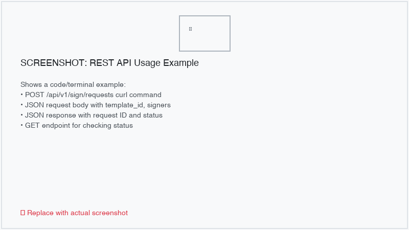

Authentication
--------------

API requests must be authenticated using one of the following methods:

- **Odoo session**: standard session cookie obtained after logging in via ``/web/session/authenticate``.
- **API key**: pass the key in the ``Authorization`` header as ``Bearer <api_key>``.

Endpoints
---------

Create a signing request
~~~~~~~~~~~~~~~~~~~~~~~~

.. code-block:: text

   POST /api/v1/sign/requests

**Request body (JSON):**

.. code-block:: json

   {
     "template_id": 5,
     "reference": "Contract #1234",
     "signers": [
       {"role_id": 1, "partner_id": 10},
       {"role_id": 2, "partner_id": 15}
     ],
     "sign_order": "sequential",
     "expiry_date": "2026-04-30"
   }

**Response:** ``201 Created`` with the request ID and access tokens.

Get request status
~~~~~~~~~~~~~~~~~~

.. code-block:: text

   GET /api/v1/sign/requests/<id>

**Response:** ``200 OK`` with the request details including state, signers, and their individual
statuses.

Download signed document
~~~~~~~~~~~~~~~~~~~~~~~~

.. code-block:: text

   GET /api/v1/sign/requests/<id>/document

**Response:** ``200 OK`` with the signed PDF as a binary download (available only when the request
is in the *Signed* state).

List requests
~~~~~~~~~~~~~

.. code-block:: text

   GET /api/v1/sign/requests?state=signed&limit=20&offset=0

**Query parameters:**

- ``state``: filter by request state (``draft``, ``sent``, ``signed``, ``refused``, ``canceled``,
  ``expired``).
- ``limit``: maximum number of results (default: 20).
- ``offset``: number of results to skip (default: 0).

**Response:** ``200 OK`` with a paginated list of sign requests.

.. _sign/audit:

Audit & verification
====================

eYssen Sign maintains an immutable, hash-chained audit trail for every signing request, providing
strong evidence of document integrity and the signing process.

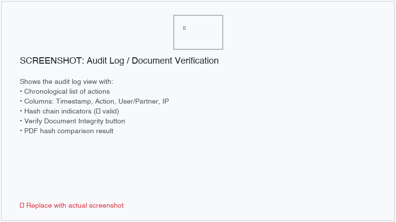

Hash-chained audit trail
-------------------------

Every action on a signing request creates an audit log entry. Each entry contains:

- **Action**: the type of event (e.g., ``created``, ``sent``, ``opened``, ``signer_completed``,
  ``signer_refused``, ``expired``, ``canceled``).
- **Timestamp**: the server-side timestamp of the action (never client-supplied).
- **User / Partner**: the user or partner who performed the action.
- **IP address**: the IP address from which the action was performed.
- **User agent**: the browser or client identification string.
- **Geolocation**: latitude and longitude (if captured during signing).
- **Previous hash**: the hash of the preceding log entry.
- **Current hash**: the HMAC-SHA256 hash of this entry, computed using the previous hash and a
  server-side secret.

The hash chain ensures that any tampering with or deletion of log entries is detectable. Each new
entry cryptographically links to the previous one, forming an unbreakable chain.

.. important::
   Audit log entries are **immutable**. Any attempt to modify or delete a log entry raises an error.
   This guarantees the integrity of the audit trail.

Document verification
---------------------

eYssen Sign provides two levels of document verification:

#. **Hash chain verification**: verifies that the entire audit log chain is intact by recomputing
   each entry's hash and comparing it to the stored value.
#. **PDF SHA-256 comparison**: computes the SHA-256 hash of the completed signed PDF and compares it
   to the hash recorded at the time of signing. Any modification to the PDF after signing is
   detected.

To verify a document, open the signing request and click :guilabel:`Verify Document`. The system
reports whether the hash chain and document hash are valid.

Audit report
------------

An audit report can be generated for any completed signing request. The report includes the complete
audit trail, signer information, timestamps, IP addresses, and the document hash. This report can
be downloaded as a PDF and serves as supporting evidence of the signing process.

.. _sign/integrations:

Integrations
============

eYssen Sign integrates with other Odoo modules to streamline document-centric business processes.

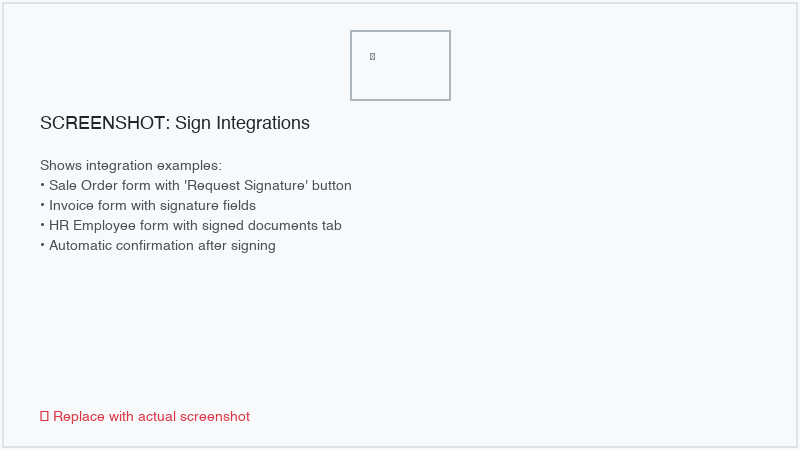

Sale orders
-----------

Link a signing request to a sale order. When the document is fully signed:

- The sale order is **automatically confirmed**.
- The signed PDF is **attached** to the sale order record.

To link a request to a sale order, select the :guilabel:`Sale Order` field on the request form or
create a signing request directly from a sale order.

Invoices
--------

Link a signing request to a customer invoice (``account.move``). When the document is fully signed:

- The invoice is **automatically posted**.
- The signed PDF is **attached** to the invoice record.

To link a request to an invoice, select the :guilabel:`Invoice` field on the request form.

HR employees
------------

Link a signing request to an employee record. When the document is fully signed, the signed PDF is
**attached** to the employee record. This is useful for employment contracts, onboarding documents,
and HR policies.

To link a request to an employee, select the :guilabel:`Employee` field on the request form. You can
also access an employee's signed documents directly from the employee form view.

.. _sign/settings:

Settings
========

Configure eYssen Sign at :menuselection:`Sign --> Configuration --> Settings`.

Company Terms & Conditions
--------------------------

Define the Terms & Conditions text that is displayed to signers before they finalize their
signature. The Terms & Conditions are configured per company using a rich-text (HTML) editor.

Default 2FA settings
--------------------

Set the default two-factor authentication method for new signing requests. This default can be
overridden on individual requests.

SMS credits
-----------

If you use SMS-based 2FA verification, you need SMS credits. Click :guilabel:`Buy Credits` to
purchase additional credits.

Template access control
-----------------------

Control who can create, edit, and use templates:

- **Sign User**: can use templates to create and send signing requests. Can view their own requests
  and requests where they are a signer or follower.
- **Sign Manager**: full access to all templates, requests, and configuration. Can manage roles,
  field types, workflows, webhooks, and settings.

.. _sign/security:

Security
--------

eYssen Sign implements multiple layers of security:

- **Role-based access**: the *Sign User* and *Sign Manager* groups control access levels. Users can
  only see requests they created, are assigned to sign, or are following.
- **Record rules**: enforce row-level security so users cannot access requests belonging to others
  unless they are a participant.
- **Rate limiting**: the shared signing endpoint implements rate limiting to prevent abuse.
- **SSRF protection**: webhook URLs are validated to block requests to private or internal network
  addresses.
- **XSS protection**: chatter messages and user-supplied content are sanitized to prevent
  cross-site scripting attacks.
- **State machine enforcement**: terminal states (*Signed*, *Refused*, *Canceled*, *Expired*)
  cannot be reversed, preventing unauthorized state manipulation.
