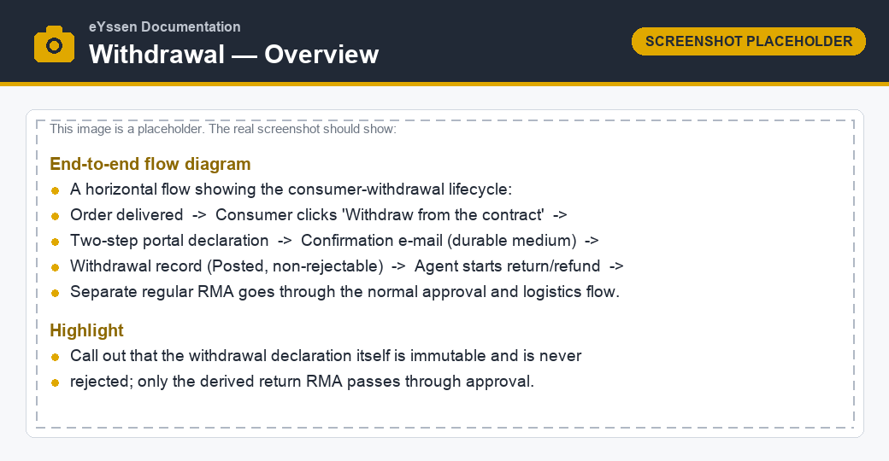

===================
Right of withdrawal
===================

The **Right of withdrawal** feature lets a webshop consumer formally *withdraw from the contract*
— the legally binding, no-reason cancellation guaranteed to consumers by EU law — directly from the
customer portal, without contacting support and without logging in.

It is built on top of the standard eYssen **RMA** (Return Merchandise Authorization) system: the
:doc:`backend <withdrawal/backend>` adds a dedicated, non-rejectable *withdrawal declaration*
record, while the :doc:`customer portal <withdrawal/consumer_portal>` adds the public, two-step
declaration flow and the durable-medium confirmation e-mail.

Legal background
================

The feature implements the mandatory online **withdrawal button** required by
**Directive (EU) 2023/2673** (which amends the Consumer Rights Directive 2011/83/EU, articles 11a
and 11b). For distance and off-premises contracts, the trader must offer consumers an easily
accessible electronic withdrawal function and confirm receipt of the withdrawal on a **durable
medium** (e.g. e-mail).

.. important::
   The on-screen legal wording (button labels, the declaration text and the confirmation e-mail) is
   provided as a **draft pending legal review**. Have the texts approved by your legal counsel
   before going live. The texts live in editable QWeb templates and a :guilabel:`mail.template`, so
   they can be adjusted without code changes.

Key principles
==============

The withdrawal declaration is treated very differently from an ordinary return request:

- **Legally binding and irrevocable.** A confirmed withdrawal can never be *rejected* — it is a
  unilateral consumer statement. The backend enforces this with database-level guards.
- **Immutable proof.** At confirmation time the system stores a frozen snapshot of the declaration
  (consumer, products, quantities, exact timestamp) and sends a durable-medium confirmation e-mail.
- **No automatic logistics.** A withdrawal never auto-generates a return picking or a refund. An RMA
  agent decides how to handle the physical return and the refund manually.
- **B2C scope only.** The feature is available only for genuine business-to-consumer webshop orders
  (see :doc:`withdrawal/consumer_portal`).

Scope and modules
=================

The feature is delivered by two modules:

- **RMA** (``eyssen_rma``) — the backend withdrawal declaration, configuration, the
  :guilabel:`Withdrawals` menu and the confirmation e-mail.
- **RMA - Website Portal** (``eyssen_rma_website_sale``) — the public portal pages, the withdrawal
  button on the order page and the login-free link in the order-confirmation e-mail.

.. toctree::
   :titlesonly:

   withdrawal/consumer_portal
   withdrawal/backend
   withdrawal/configuration
