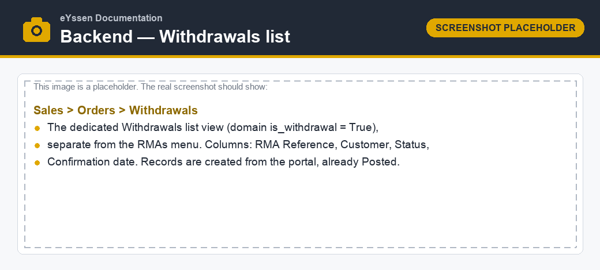
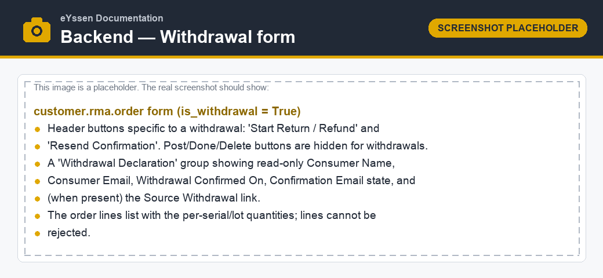
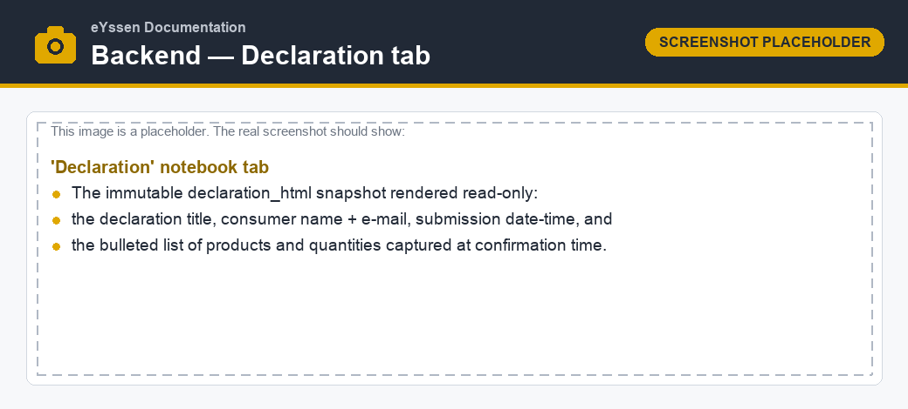
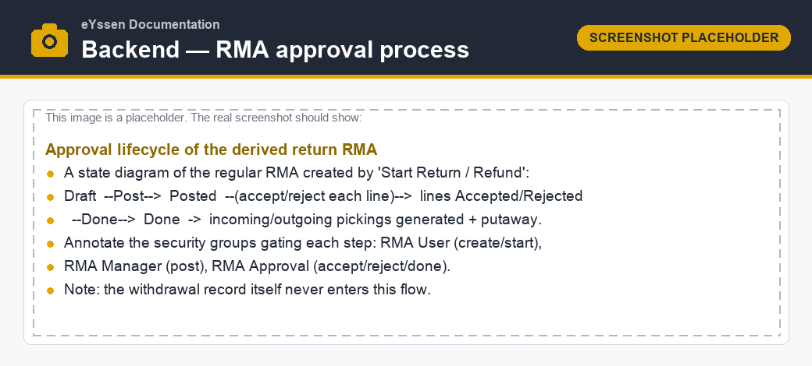

==============================
Handling withdrawals (backend)
==============================

This page describes how an RMA agent works with confirmed withdrawal declarations in the backend,
how a withdrawal is turned into a physical return, and the full **RMA approval process** that the
derived return then follows.

The Withdrawals menu
====================

Confirmed declarations are listed under :menuselection:`Sales --> Orders --> Withdrawals`. This menu
is kept **separate** from :menuselection:`Sales --> Orders --> RMAs`: the :guilabel:`RMAs` list shows
only ordinary returns, while the :guilabel:`Withdrawals` list shows only withdrawal declarations.

Records arrive here automatically from the portal, already in the :guilabel:`Posted` state.

The withdrawal declaration form
===============================

A withdrawal record looks like an RMA but exposes withdrawal-specific information and actions:

- a **Withdrawal Declaration** group with the read-only :guilabel:`Consumer Name`,
  :guilabel:`Consumer Email`, :guilabel:`Withdrawal Confirmed On` (the durable-proof timestamp), the
  :guilabel:`Confirmation Email` state, and — once a return has been started — the
  :guilabel:`Source Withdrawal` link;
- the **order lines** with the withdrawn products and quantities (one line per serial for
  serial-tracked products); and
- two dedicated header buttons: :guilabel:`Start Return / Refund` and
  :guilabel:`Resend Confirmation`.

The :guilabel:`Post`, :guilabel:`Done` and :guilabel:`Delete` buttons that exist on ordinary RMAs are
**hidden** for a withdrawal, because a declaration is never processed through that flow.

The declaration snapshot
------------------------

The :guilabel:`Declaration` tab shows the **immutable HTML snapshot** captured at confirmation time:
the declaration title, the consumer's name and e-mail, the submission timestamp and the list of
products and quantities. This snapshot is the legal record and is never recomputed.

Non-rejectable guarantees
=========================

Because a withdrawal is a legally binding statement, several database-level guards prevent it from
being treated like a rejectable RMA:

- a declaration **line cannot be set to** :guilabel:`Rejected`;
- the manual :guilabel:`Post`, mark-as-:guilabel:`Done` and auto-approve actions all **refuse to
  run** on a withdrawal; and
- the *is-withdrawal* flag is set at creation and **cannot be changed** afterwards, so a record can
  never be flipped between an ordinary RMA and a withdrawal.

The confirmation e-mail
=======================

The durable-medium confirmation e-mail is sent automatically when the declaration is confirmed. It
is **resilient by design** — a mail failure must never invalidate an already-valid withdrawal:

- the :guilabel:`Confirmation Email` field tracks the state: :guilabel:`Pending`, :guilabel:`Sent`
  or :guilabel:`Failed`;
- if sending fails, the error is logged and a **to-do activity** is scheduled for the agent instead
  of raising an error; and
- the agent can retry at any time with the :guilabel:`Resend Confirmation` button. There is **no
  automatic retry cron** — recovery is always a deliberate manual action.

Starting the physical return and refund
=======================================

A withdrawal record never moves stock or money on its own. When the consumer ships the goods back
(or the agent otherwise decides to process the return), the agent clicks :guilabel:`Start Return /
Refund`.

This creates a **separate, ordinary RMA** from the withdrawal's lines:

- the new RMA is a normal, *rejectable* return (it is **not** a withdrawal);
- it links back to the declaration through the :guilabel:`Source Withdrawal` field; and
- the original withdrawal record stays **inert, immutable and non-rejectable** — it is never run
  through the picking or refund logic itself.

.. note::
   The withdrawn quantities are not double-counted. While the derived return RMA exists, the
   originating withdrawal is excluded from the open-quantity budget, so the same units are never
   counted as committed twice.

The new RMA then follows the standard RMA approval process described below.

The RMA approval process
========================

The return RMA — whether created from a withdrawal, from the portal, or manually — moves through a
three-state lifecycle. Each step is gated by a security group.

Draft → Posted
--------------

:guilabel:`Post` validates and submits the request (requires the **RMA Manager** group):

- every line with a positive quantity must have a **return reason**;
- the RMA receives its sequence reference; and
- the order is tagged on the linked sales order with the *requested* status.

The :guilabel:`Apply Reason to Lines` helper can set one reason (and its destination location) on
all draft lines at once.

Posted → line decisions
-----------------------

Each line is then individually **accepted** or **rejected** (requires the **RMA Approval** group):

- :guilabel:`Accept` — the accepted quantity may not exceed the delivered quantity;
- :guilabel:`Reject` — a **reason for rejection** is mandatory.

Posted → Done
-------------

:guilabel:`Mark as Done` finalizes the RMA (requires the **RMA Approval** group). It is only allowed
once **every** line has been accepted or rejected. On completion the system **generates the stock
pickings**:

- **incoming** pickings for returned/replaced/refunded and non-pickup lines; and
- **outgoing** pickings for replacement and resend lines, respecting the warehouse's multi-step
  delivery configuration.

Returns putaway
~~~~~~~~~~~~~~~

Each returned product is routed to a destination resolved in this order:

#. an explicit **destination location** set on the line (or inherited from the reason);
#. the **shelf** (configured storage category) under the warehouse where the product already has the
   most stock on hand;
#. the company's **WEB return location** (when it belongs to that warehouse); otherwise
#. the warehouse stock location.

See :doc:`configuration` for the shelf category and WEB return location settings.

Order status feedback
=====================

As the return progresses, the linked sales order is automatically tagged with the current RMA
status — for example *requested*, *refused*, *being returned*, *taken back* or *closed* — so the
sales team always sees the live state. A non-pickup return additionally flags the order as needing a
manual refund for the finance team.

.. important::
   Withdrawal declarations never receive an order status tag and never appear in the order-status
   feedback: only the ordinary RMAs do. The withdrawal itself remains a pure legal record.

Security groups
===============

The actions above are restricted to the RMA security groups:

- **RMA User** — create RMAs and start a return from a withdrawal;
- **RMA Manager** — post and delete RMAs; and
- **RMA Approval** — accept or reject lines and mark an RMA as done.

.. note::
   The **Sales / Administrator** (Sales manager) group includes **RMA Approval** by default. Sales
   managers therefore see the :menuselection:`Sales --> Orders --> RMAs` and :guilabel:`Withdrawals`
   menus and can process withdrawals out of the box, without any extra per-user configuration. Grant
   the **RMA Manager** group separately to users who also need to configure return reasons or delete
   RMAs.

.. seealso::
   - The consumer-facing flow: :doc:`consumer_portal`
   - Periods, deadlines and putaway settings: :doc:`configuration`
