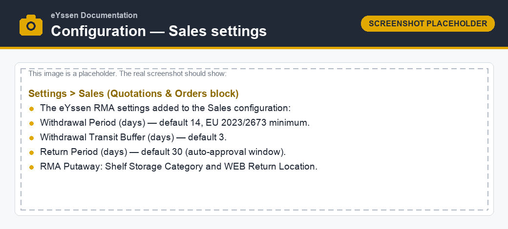

=============
Configuration
=============

The withdrawal period, the receipt estimate and the returns putaway are configured per company in
the **Sales** settings.

Settings
========

Go to :menuselection:`Sales --> Configuration --> Settings` and find the following options in the
:guilabel:`Quotations & Orders` section:

.. list-table::
   :header-rows: 1
   :widths: 30 15 55

   * - Setting
     - Default
     - Description
   * - :guilabel:`Withdrawal Period (days)`
     - 14
     - The legal consumer withdrawal period. The 14-day minimum is mandated by Directive (EU)
       2023/2673 / 2011/83/EU; you may set a **longer** period, but not a shorter one.
   * - :guilabel:`Withdrawal Transit Buffer (days)`
     - 3
     - Days added to the carrier hand-over date to **estimate the consumer receipt date** when no
       carrier delivered-date is available (see `How the deadline is calculated`_).
   * - :guilabel:`Return Period (days)`
     - 30
     - The window (from the delivered date) within which an ordinary customer web return is
       auto-approved. This is **separate** from the legal withdrawal period.
   * - :guilabel:`RMA Putaway — Shelf Category`
     - —
     - The storage category that marks the physical shelves. A return is routed to the shelf where
       the product already has stock.
   * - :guilabel:`RMA Putaway — WEB Return Location`
     - —
     - The fallback destination for returned products that are not yet on any shelf.

How the deadline is calculated
==============================

The withdrawal deadline is computed **per order line**, based on the **actual receipt date** of the
outgoing delivery that shipped that line — not the date the goods were handed to the carrier.

The receipt date is determined as follows:

#. if the carrier reports a **delivered-date** for the shipment, that date is used; otherwise
#. the carrier **hand-over date** plus the :guilabel:`Withdrawal Transit Buffer` is used as an
   estimate.

The per-line **withdrawal deadline** is then the receipt date plus the :guilabel:`Withdrawal Period`.

.. example::
   With the defaults, a parcel handed to the carrier on the 1st with no carrier delivered-date gets
   an estimated receipt date of the 4th (3-day buffer) and a withdrawal deadline of the 18th
   (14-day period).

.. note::
   A line that has **not shipped yet** has no deadline. The withdrawal button is still available for
   such lines, because consumers may withdraw before they receive the goods.

.. important::
   The 14-day value is a **legal minimum**, not a recommendation to shorten. Configure a longer
   period if your terms grant one, and have the on-screen legal texts reviewed by your legal counsel
   before going live (see :doc:`../withdrawal`).

Return reasons
==============

The reasons offered on the portal return form are the :guilabel:`Customer RMA Reason` records
flagged as available to the portal. Withdrawals do not require a reason — a withdrawal is a no-reason
right — but the **ordinary return** an agent starts from a withdrawal does, so make sure at least one
refund-type reason is configured.

.. seealso::
   - :doc:`consumer_portal`
   - :doc:`backend`
