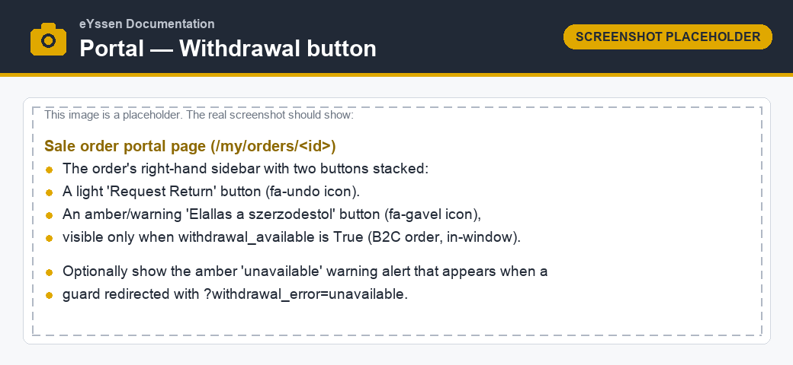
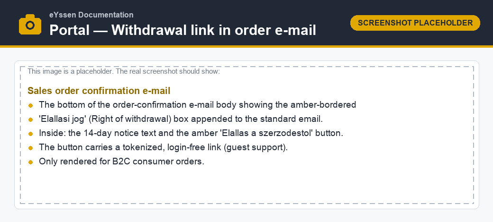
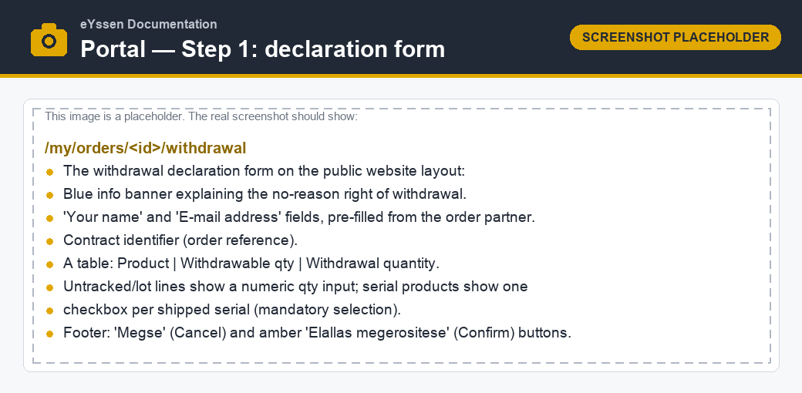
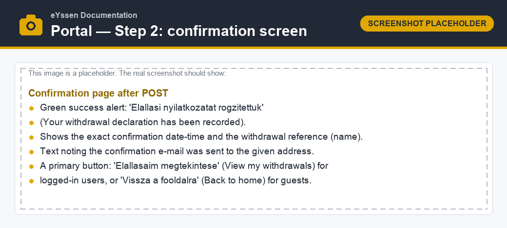
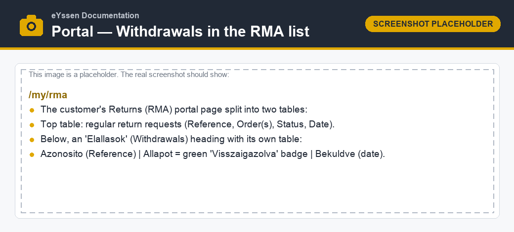

=========================
Withdrawal on the portal
=========================

This page describes everything the **consumer** experiences: where the withdrawal button appears,
when it is available, the two-step declaration flow, the confirmation, and how withdrawals are
listed afterwards.

Who can withdraw
================

The withdrawal function is offered **only to business-to-consumer (B2C) webshop consumers**. An
order qualifies when **all** of the following are true:

- the order originates from a website (it has a :guilabel:`Website`);
- the order's commercial partner is a **private person** (:guilabel:`Individual`); and
- that partner has **no VAT number**.

This *B2C consumer* test is centralized in the backend and re-checked on every step, so a non-B2C
order can never reach the withdrawal flow — even by manipulating a URL.

In addition, the button is only shown while the order is **confirmed** (:guilabel:`Sales Order`
state) and at least one order line is still **withdrawable** — that is, it has remaining withdrawable
quantity and its per-line deadline has not passed. Lines that have not shipped yet count as *not
expired*, so a consumer may withdraw **before** the parcel is even received.

Entry points
============

A consumer can open the declaration in two ways.

From the order page
-------------------

On the order page (:menuselection:`My Account --> Orders --> (an order)`), the sidebar shows an
amber :guilabel:`Elállás a szerződéstől` ("Withdraw from the contract") button next to the regular
:guilabel:`Request Return` button. The withdrawal button only appears when the order is eligible (see
`Who can withdraw`_).

.. note::
   If a guard redirects back to the order page because the function is no longer available (expired
   deadline or no withdrawable line), a warning notice is shown explaining why.

From the order-confirmation e-mail
----------------------------------

For B2C consumer orders, an amber **Right of withdrawal** block is delivered by e-mail at order
confirmation. It contains a short 14-day notice and an :guilabel:`Elállás a szerződéstől` button that
opens the declaration through a **tokenized, login-free link**. This means even a guest who checked
out without an account can exercise the right of withdrawal directly from the e-mail.

The block is delivered when the order becomes a confirmed :guilabel:`Sales Order`, because the
tokenized link only works from confirmation onward. How it reaches the consumer depends on how the
shop confirms orders:

- **Orders confirmed automatically** (for example, paid online at checkout) — the block rides along
  in the **standard order-confirmation e-mail**.
- **Orders confirmed manually** (for example, offline or on-pickup payment, where the order first
  stays a quotation until staff press :guilabel:`Confirm`) — the standard confirmation e-mail is not
  sent at that point, so a **dedicated withdrawal e-mail** carrying the same block is sent
  automatically the moment the order is confirmed. It is sent **once per order** and only to B2C
  consumers.

.. note::
   If the order is still a quotation (not yet confirmed), the withdrawal button is not yet active —
   the link reports that withdrawal is *unavailable* until the order is confirmed.

Step 1 — The declaration form
=============================

The first step collects the declaration:

- **Consumer identity** — the :guilabel:`Your name` and :guilabel:`E-mail address` fields are
  pre-filled from the order's customer and can be adjusted. Both are required. The consumer identity
  is always taken from the order, never from the logged-in session, so guest declarations are
  attributed correctly.
- **Contract reference** — the sales order number is shown as the contract identifier.
- **Items and quantities** — a table lists every eligible line with its withdrawable quantity:

  - *Untracked* and *lot-tracked* products show a numeric **quantity** input, capped at the
    withdrawable quantity.
  - *Serial-tracked* products show **one checkbox per shipped serial number**. Selecting concrete
    serials is **mandatory** — a serial line cannot be withdrawn by quantity alone.

The consumer confirms with the amber :guilabel:`Elállás megerősítése` ("Confirm withdrawal") button,
or backs out with :guilabel:`Mégse` ("Cancel").

Validation
----------

If something is wrong, the form is redisplayed with a message. The form blocks, among others:

- a quantity greater than the withdrawable amount;
- an empty submission (no line chosen);
- a missing name or e-mail;
- a line whose per-line deadline has already expired; and
- a serial-tracked product submitted without any serial selected.

Step 2 — Confirmation and proof
===============================

On confirmation, the system:

#. records the exact **server timestamp** of the confirmation as durable proof;
#. stores an **immutable snapshot** of the declaration (consumer, products, quantities, time);
#. creates the backend **withdrawal declaration** record (already in :guilabel:`Posted` state); and
#. sends the **durable-medium confirmation e-mail** to the address provided.

The consumer then sees a success screen showing the confirmation date-time and the withdrawal
reference. Logged-in customers get a :guilabel:`Elállásaim megtekintése` ("View my withdrawals")
button; guests get a :guilabel:`Vissza a főoldalra` ("Back to home") button.

.. note::
   Two concurrent confirmations cannot create duplicate or over-quantity declarations: the order and
   its lines are row-locked while the quantities are re-validated, so a double submit is rejected.

Tracking withdrawals
====================

Logged-in customers can review their withdrawals under :menuselection:`My Account --> Returns
(RMA)`. The page lists ordinary return requests at the top and, below them, a separate
:guilabel:`Elállások` ("Withdrawals") section where each confirmed declaration shows its reference, a
green :guilabel:`Visszaigazolva` ("Confirmed") status and the submission date.

.. seealso::
   - How agents process a confirmed withdrawal: :doc:`backend`
   - Withdrawal period and deadlines: :doc:`configuration`
