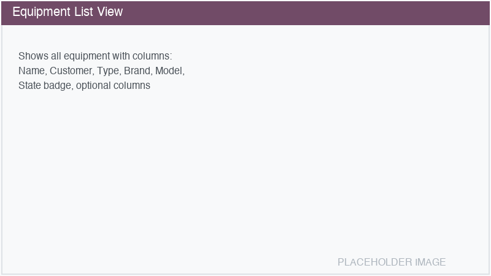

===================
Equipment Management
===================

**Equipment Management** allows you to manage and track all types of physical equipment — printers,
measuring devices, IT infrastructure, forklifts, cranes, and more — from a single centralized hub.
It connects equipment to maintenance, invoicing, purchasing, fleet, stock, and project management,
giving you a complete overview of each asset's lifecycle.

.. toctree::
   :titlesonly:

   equipment/getting_started
   equipment/equipment_form
   equipment/integrations
   equipment/documents
   equipment/settings
   equipment/security
   equipment/equipment_printer
   equipment/equipment_measuring
