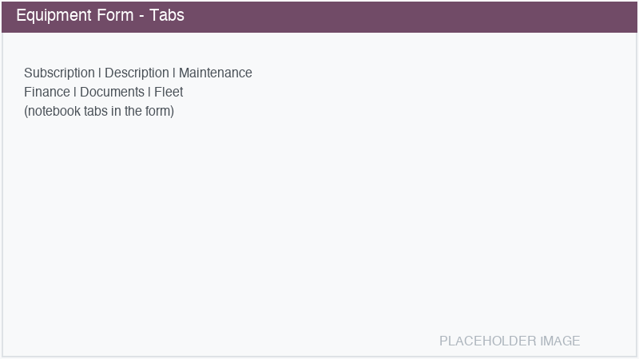
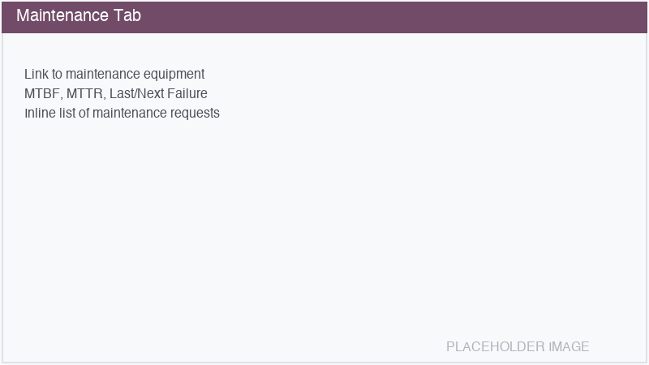
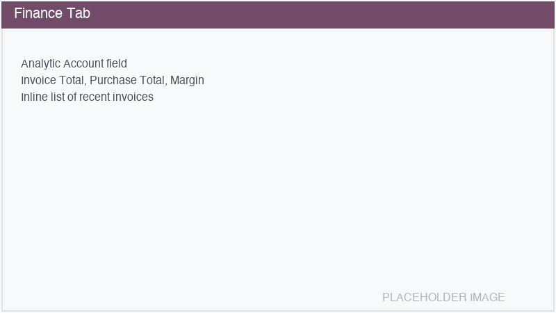
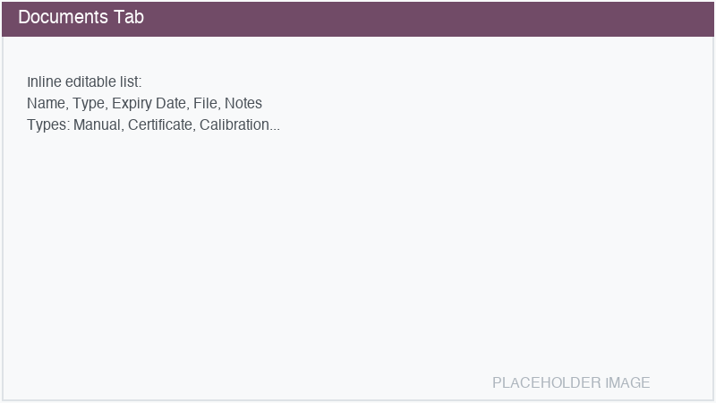
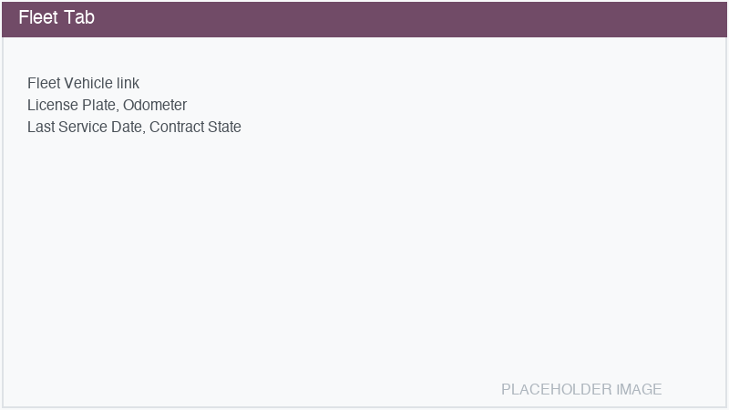
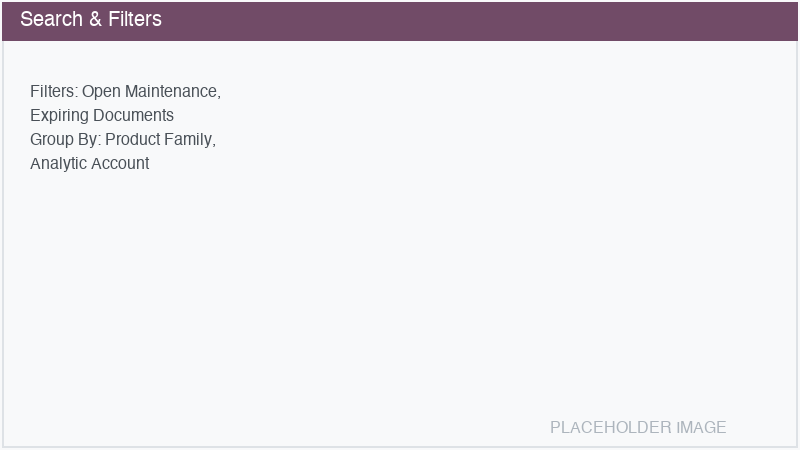

==============
Equipment Form
==============

The equipment form is a **single pane of glass** — a central hub where all Odoo data related to a
piece of equipment is visible in one place.

.. image:: equipment-form-overview.png
   :alt: Equipment form overview

Header
======

The form header contains:

- **Create Ticket** button: Creates a project task linked to this equipment. Only visible when the
  equipment is *Active* and has at least one project assigned.
- **Status bar**: Click to change the state (*Draft* → *Active* → *Inactive*).

Stat buttons
============

Stat buttons appear at the top of the form, providing quick access to related records:

- **Maintenance**: Shows open/total maintenance requests. Only visible when a maintenance equipment
  is linked. Click to view all maintenance requests.
- **Invoices**: Shows invoice count and total amount. Only visible when invoices exist. Click to
  view related invoices.
- **Tickets**: Shows the number of project tasks linked to this equipment. Click to view all tasks.
- **Purchases**: Shows purchase order count and total amount. Only visible when purchases exist.
  Click to view related purchase orders.
- **Documents**: Shows the number of attached documents. Click to view all documents.
- **Fleet**: Only visible when a fleet vehicle is linked. Click to open the fleet vehicle form.

Main fields
===========

The main section contains core equipment data organized in groups:

**Left column:**

- **Subscription Service**: If the equipment is part of a subscription.
- **Customer**: The customer using the equipment.
- **Owner**: The legal owner.
- **Assignees**: Users responsible for this equipment.
- **Sales Team**: The responsible sales team.
- **Projects**: Projects linked to this equipment for ticket management.
- **Tags**: Categorization tags.

**Right column:**

- **Type**: General, Printer, Measuring Device, etc.
- **Manufacturer**: The equipment brand.
- **Model**: The specific model (filtered by brand and type).
- **Product**: Automatically set from the model's linked product.
- **Product Family**: The product family classification.
- **Production Year**: Year of manufacture.
- **Warranty Expiration**: Warranty end date.

**Location group:**

- **Location**: Delivery address of the customer.
- **Location Name** and **Address**: Auto-filled from the selected location.

**Contact group:**

- **Contact**: Contact person at the customer site.
- **Contact Name**, **Email**, **Phone**: Auto-filled from the selected contact.

Tabs
====

The notebook section contains multiple tabs:

Subscription tab
----------------

Only visible when a subscription service is linked. Shows pricing information and the invoicing
period.

Description tab
---------------

A rich text editor for detailed notes about the equipment. Supports collaborative editing.

Maintenance tab
---------------

- **Maintenance Equipment**: Link to the corresponding ``maintenance.equipment`` record. If not yet
  linked, click :guilabel:`Create Maintenance Equipment` to create or link one automatically.
- **MTBF (days)**: Mean Time Between Failure, computed from maintenance history.
- **MTTR (days)**: Mean Time To Repair, computed from maintenance history.
- **Last Failure**: Date of the most recent corrective maintenance.
- **Est. Next Failure**: Estimated date of the next failure based on MTBF.
- **Maintenance Requests**: Inline list of all maintenance requests for this equipment.

Finance tab
-----------

- **Analytic Account**: The dedicated analytic account for this equipment. Can be auto-created
  when the equipment is activated (see :doc:`settings`).
- **Invoice Total**: Sum of all customer invoices linked through the analytic account.
- **Purchase Total**: Sum of all purchase orders linked through the analytic account.
- **Margin**: Invoice Total minus Purchase Total.
- **Recent Invoices**: Inline list of invoices with date, amount, and payment status.

Documents tab
-------------

An inline editable list of documents attached to the equipment:

- **Name**: Document title.
- **Type**: Manual, Certificate, Calibration, Warranty, Service Book, or Other.
- **Expiry Date**: When the document expires. A daily cron job creates warning activities for
  documents expiring within the configured number of days (default: 30).
- **File**: The attached file (upload/download).
- **Notes**: Additional notes.

Fleet tab
---------

Only visible when a fleet vehicle is linked. Shows:

- **Fleet Vehicle**: Link to the ``fleet.vehicle`` record.
- **License Plate**: From the fleet vehicle.
- **Odometer**: Latest odometer reading.
- **Last Service Date**: Date of the most recent fleet service.
- **Contract State**: Current fleet contract status.

List and search views
=====================

The list view shows all equipment with optional columns that can be toggled:

- Production Year, Warranty Expiration, Product Family
- Open Maintenance count, Invoice count, Document count
- Calibration Status (when Measuring Devices module is installed)

**Search filters:**

- **Open Maintenance**: Equipment with open maintenance requests.
- **Expiring Documents**: Equipment with documents expiring within 30 days.
- **Calibration Due** / **Calibration Overdue**: Available when the Measuring Devices module is
  installed.

**Group By options:**

- Type, State, Customer, Brand, Model, Product, Tag, Project
- Product Family, Analytic Account
