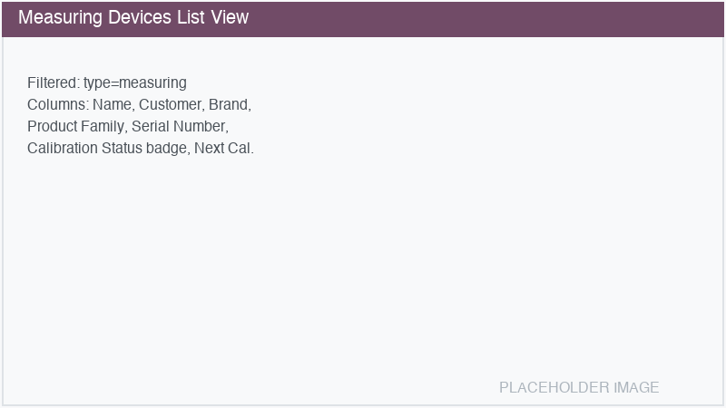
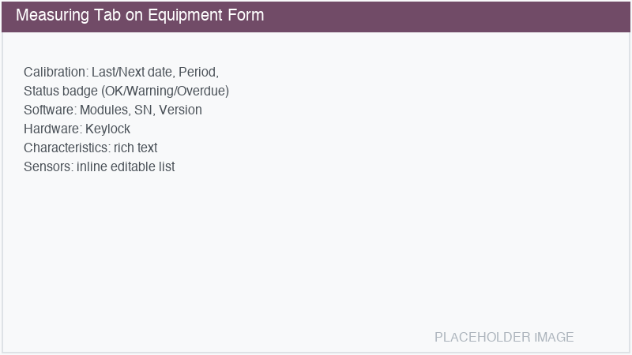
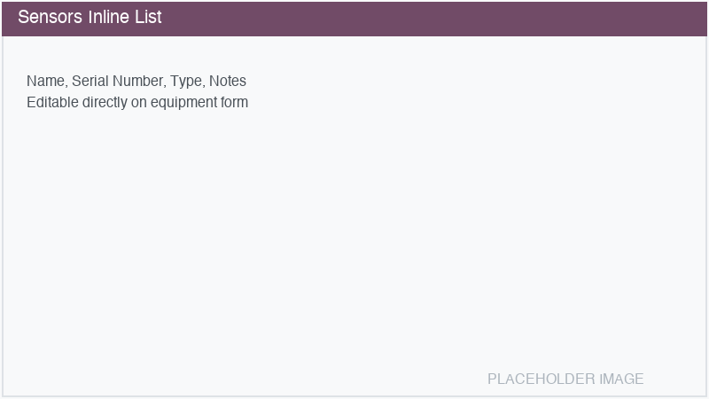
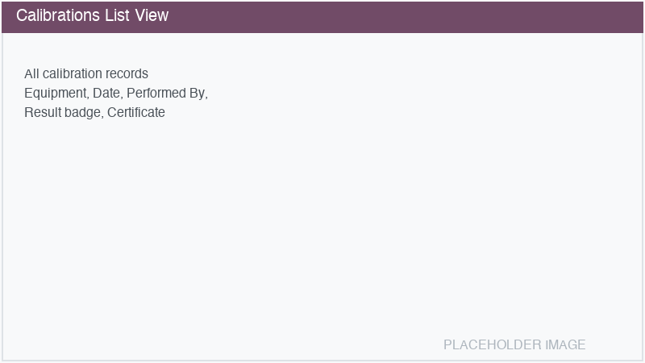
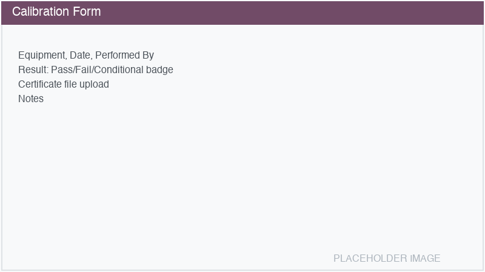

=================
Measuring Devices
=================

The **Measuring Devices** sub-module (``equipment_measuring``) extends Equipment Management with
features specific to measuring instruments such as coordinate measuring machines (CMMs), optical
measurement systems, and other precision devices. It adds calibration tracking, software and
hardware information, and sensor management.

Installation
============

Enable the Measuring Devices module from :menuselection:`Equipment Management --> Settings -->
Configuration --> Equipment Types --> Measuring Devices`, or install ``equipment_measuring`` from
the Apps menu.

Dedicated measuring views
=========================

Once installed, a **Measuring Devices** menu appears in the Equipment Management navigation:

- :menuselection:`Equipment Management --> Measuring Devices --> Measuring Devices`: Shows only
  measuring-type equipment with specific columns (calibration status, next calibration date,
  product family, serial number).
- :menuselection:`Equipment Management --> Measuring Devices --> Calibrations`: Lists all
  calibration records across all measuring devices.

Creating an equipment from the Measuring Devices menu automatically sets the type to
*Measuring Device*.

Measuring tab
=============

When an equipment has type *Measuring Device*, a dedicated :guilabel:`Measuring` tab appears on
the form with the following sections:

Calibration
-----------

- **Last Calibration Date**: Automatically computed from the most recent calibration log entry.
  Cannot be edited directly — add a calibration record instead.
- **Next Calibration Date**: Computed as Last Calibration Date + Calibration Period. Read-only.
- **Calibration Period (months)**: How often the equipment must be calibrated. Set manually.
- **Calibration Status**: Computed status badge:

  - **OK** (green): Next calibration is more than 30 days away.
  - **Warning** (yellow): Next calibration is within 30 days.
  - **Overdue** (red): Calibration date has passed, or no calibration data exists.

Software
--------

- **Software Modules**: Free-text description of installed software modules.
- **Software Serial Number**: The license serial number.
- **Software Version**: The current software version.

Hardware
--------

- **Hardware Keylock**: The hardware keylock number (dongle/license key).

Characteristics
---------------

A rich text field for technical specifications, measurement ranges, accuracy specifications, and
other characteristics of the measuring device.

Sensors
-------

An inline editable list of sensors attached to the measuring device:

- **Name**: Sensor name (e.g., "Optical Sensor", "Touch Probe SP25M").
- **Serial Number**: The sensor's serial number for tracking and warranty purposes.
- **Type**: Sensor type (free text — e.g., "Optical", "Tactile", "Chromatic Focus Point").
- **Notes**: Additional notes.

Click the :guilabel:`Sensors` stat button to view sensors in a dedicated list view.

Calibration management
======================

Calibration records track the complete calibration history of each measuring device.

Creating a calibration record
-----------------------------

#. Navigate to :menuselection:`Equipment Management --> Measuring Devices --> Calibrations`.
#. Click :guilabel:`New`.
#. Fill in the required fields:

   - **Equipment**: The measuring device being calibrated.
   - **Calibration Date**: The date the calibration was performed (defaults to today).
   - **Result**: The calibration outcome:

     - **Pass**: Equipment is within specifications.
     - **Fail**: Equipment is out of specification and needs repair/adjustment.
     - **Conditional**: Equipment passes with limitations or notes.

#. Optionally fill in:

   - **Performed By**: Name or organization that performed the calibration.
   - **Certificate**: Upload the calibration certificate (PDF, etc.).
   - **Notes**: Any additional observations.

#. Save.

The equipment's **Last Calibration Date** and **Next Calibration Date** are automatically updated
based on the latest calibration record.

.. tip::
   You can also create calibration records directly from the equipment form by clicking the
   :guilabel:`Calibrations` stat button and then :guilabel:`New`.

Calibration workflow
--------------------

A typical calibration workflow:

#. The daily cron job (or the Calibration Status badge on the form) alerts that calibration is due.
#. A technician performs the calibration.
#. A calibration record is created with the result and certificate.
#. The system automatically updates the next calibration date.
#. The Calibration Status returns to *OK*.

Search and filtering
--------------------

The calibration list view includes:

- **Filters**: Pass, Fail, Conditional results.
- **Group By**: Equipment, Result, Date (by month).

Stat buttons
============

Measuring-type equipment shows additional stat buttons:

- **Calibrations**: Total number of calibration records. Click to view the full calibration
  history.
- **Sensors**: Number of attached sensors. Only visible when sensors exist. Click to view sensors.

Dedicated search filters
========================

The measuring devices list view includes specific search capabilities:

- **Filter: Calibration Due**: Measuring devices with calibration due within 30 days.
- **Filter: Calibration Overdue**: Measuring devices past their calibration date.
- **Group By: Product Family**: Group measuring devices by product family.
- **Group By: Calibration Status**: Group by OK/Warning/Overdue status.
