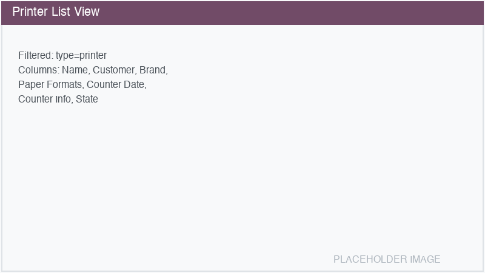
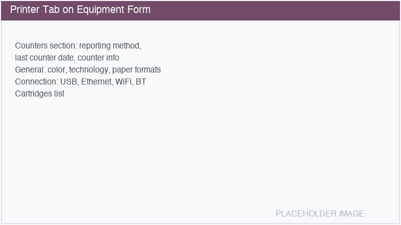
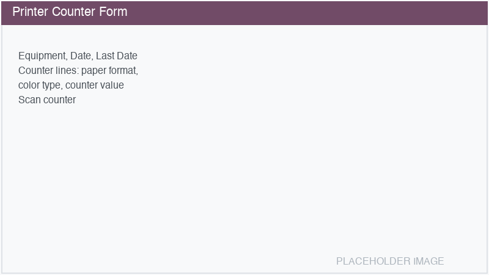

========
Printers
========

The **Printers** sub-module (``equipment_printer``) extends Equipment Management with
printer-specific features: counter tracking, cartridge management, paper format support, and
connection type details.

Installation
============

Enable the Printers module from :menuselection:`Equipment Management --> Settings -->
Configuration --> Equipment Types --> Printers`, or install ``equipment_printer`` from the Apps
menu.

Dedicated printer views
=======================

Once installed, a **Printers** menu appears in the Equipment Management navigation:

- :menuselection:`Equipment Management --> Printers --> Printers`: Shows only printer-type
  equipment with printer-specific columns (paper formats, counter date, reporting method).
- :menuselection:`Equipment Management --> Printers --> Counters`: Lists all printer counter
  records across all printers.

Creating a printer from the Printers menu automatically sets the type to *Printer*.

Printer tab
===========

When an equipment has type *Printer*, a dedicated :guilabel:`Printer` tab appears on the form
with the following sections:

Counters section
----------------

- **Counter Reporting Method**: How counter readings are collected — API (automatic), Email
  (automatic), SNMP (automatic), Portal (manual), Email (manual), or Call (manual).
- **Last Counter Date**: Date of the most recent counter reading, with color coding:

  - **Green**: Less than 30 days old.
  - **Yellow**: 30-60 days old.
  - **Red**: More than 60 days old.

- **Last Counter**: Summary of the latest counter reading values.

General section
---------------

These fields are inherited from the equipment model and are read-only:

- **Color**: Black & White or Color (from the model).
- **Multifunctional**: Whether the printer is multifunctional.
- **Technology**: Inkjet, Laser, etc.
- **Paper Formats**: Supported paper sizes.
- **Double Sided**: Whether duplex printing is supported.
- **Document Feeder**: Whether the printer has an automatic document feeder.

Connection section
------------------

- **USB**, **Ethernet**, **WiFi**, **Bluetooth**: Connection types supported (from the model).

Cartridges section
------------------

Lists the compatible cartridges for this printer model, showing name, product, and pages per
cartridge.

Counter management
==================

Printer counters track page counts over time. Each counter record contains:

- **Equipment**: The printer this counter belongs to.
- **Date**: The date of the reading (one reading per day per printer).
- **Counter Lines**: One line per paper format and color type (B&W / Color), showing the current
  counter value and the previous reading for comparison.
- **Scan Counter**: The scanner counter (for multifunctional printers).

**Creating a counter reading:**

#. Navigate to :menuselection:`Equipment Management --> Printers --> Counters`.
#. Click :guilabel:`New`.
#. Select the **Equipment** (printer).
#. The counter lines are auto-populated based on the printer's paper formats and color capabilities,
   pre-filled with the last known values.
#. Enter the new counter values.
#. Save.

.. warning::
   Counter values cannot be lower than the previous reading. This prevents accidental data entry
   errors. Only the most recent counter record can be deleted.

Stat buttons
============

Printer-type equipment shows additional stat buttons:

- **Counters**: Number of counter records. Click to view the counter history.
- **Equipments**: Count of task products linked to this printer.

Settings menu
=============

The Printers module adds entries to :menuselection:`Equipment Management --> Settings`:

- **Cartridges**: Manage cartridge definitions (name, product, pages per cartridge).
- **Paper Formats**: Manage paper format definitions used by printers.
