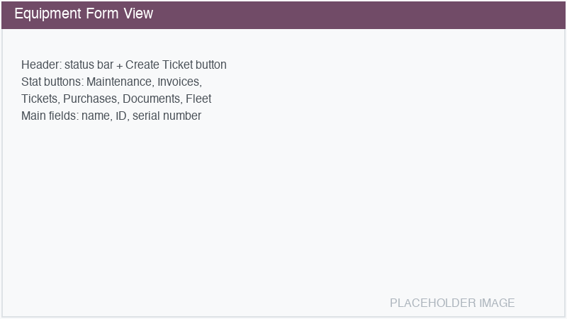

===============
Getting Started
===============

Installation
============

Navigate to :menuselection:`Apps` and search for **Equipment Management**. Click :guilabel:`Install`.

The module installs as a standalone application with its own top-level menu item in the main
navigation bar.

.. tip::
   Sub-modules for specific equipment types (Printers, Measuring Devices) can be enabled in
   :menuselection:`Equipment Management --> Settings --> Configuration` or installed separately
   from the Apps menu.

Creating your first equipment
=============================

#. Navigate to :menuselection:`Equipment Management --> All Equipment`.
#. Click :guilabel:`New`.
#. Fill in the required fields:

   - **Name**: A descriptive name for the equipment (e.g., "Werth VideoCheck HA 400x400").
   - **Equipment ID**: Auto-generated from the configured sequence (e.g., ``EQ/0001``). You can
     override this value manually if needed.
   - **Customer**: The customer who owns or uses the equipment.
   - **Owner**: The legal owner of the equipment.

#. Set the **Type** to match the equipment category. The default is *General*. If sub-modules are
   installed, additional types become available (e.g., *Printer*, *Measuring Device*).
#. Optionally fill in:

   - **Serial Number**: The manufacturer's serial number. If a matching :doc:`stock lot
     </applications/inventory_and_mrp/inventory/product_management/product_tracking/lots>` exists,
     it will be automatically suggested.
   - **Manufacturer** and **Model**: Select from the pre-configured brand/model hierarchy.
   - **Product Family**: The product family this equipment belongs to.
   - **Production Year**: The year the equipment was manufactured.
   - **Warranty Expiration**: The date when the manufacturer's warranty expires.
   - **MAC Address**: For network-connected equipment.
   - **Sales Team**: The responsible sales team.

#. Click the :guilabel:`Draft` status bar to change the state to :guilabel:`Active`.

Equipment states
================

Each equipment record goes through three lifecycle states:

- **Draft**: Initial state when created. Equipment is being set up.
- **Active**: Equipment is in service. Activating an equipment can automatically create an analytic
  account and/or a maintenance equipment record (if configured in Settings).
- **Inactive**: Equipment is no longer in service but kept for historical reference.

Equipment ID sequence
=====================

By default, new equipment records receive an auto-generated ID using the format ``EQ/0001``,
``EQ/0002``, etc. The prefix can be customized in
:menuselection:`Equipment Management --> Settings --> Configuration --> Defaults --> Equipment ID Prefix`.

The ID field remains editable — you can override the auto-generated value at any time, for example
to match an existing internal numbering system.
