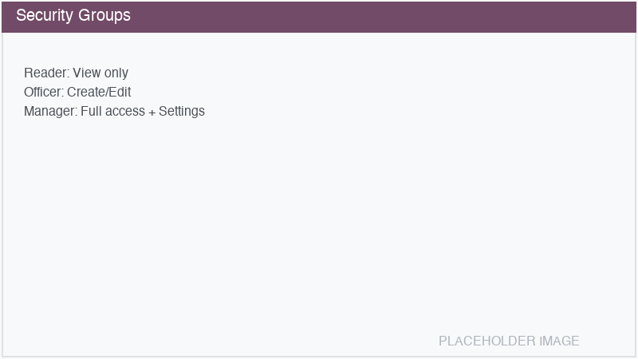

========
Security
========

Equipment Management uses a three-tier permission model to control access.

Access groups
=============

.. list-table::
   :header-rows: 1
   :widths: 20 30 50

   * - Group
     - Technical Name
     - Permissions
   * - **Reader**
     - ``equipment_group_reader``
     - View all equipment, brands, models, tags, and documents. Cannot create, edit, or delete.
       All internal Odoo users receive this group automatically.
   * - **Officer**
     - ``equipment_group_user``
     - Everything Reader can do, plus: create and edit equipment, link maintenance/fleet/stock,
       upload documents, set analytic accounts.
   * - **Manager**
     - ``equipment_group_manager``
     - Everything Officer can do, plus: delete and archive equipment, delete documents, access
       Equipment Settings/Configuration.

Assigning groups
================

#. Navigate to :menuselection:`Settings --> Users & Companies --> Users`.
#. Select a user.
#. In the :guilabel:`Access Rights` tab, find the **Equipment Management** section.
#. Select the appropriate level: *Reader*, *Officer*, or *Manager*.

.. note::
   All internal users (``base.group_user``) automatically receive **Reader** access. You only need
   to explicitly assign **Officer** or **Manager** to users who need higher access.

Multi-company rules
===================

Equipment, documents, and sensor records are filtered by company. Users can only see records
belonging to their current company (or companies they have access to in multi-company setups).

This is enforced through global record rules:

- Equipment: ``[('company_id', 'in', company_ids)]``
- Documents: ``[('equipment_id.company_id', 'in', company_ids)]``
- Sensors: ``[('equipment_id.company_id', 'in', company_ids)]``
- Calibrations: ``[('equipment_id.company_id', 'in', company_ids)]``

View-level restrictions
=======================

Certain fields on the equipment form are only visible to **Officer** and above:

- Analytic Account
- Maintenance Equipment link
- Fleet Vehicle link
- Stock Lot link

Reader users see all the data and tabs but cannot see or modify these connection fields.
