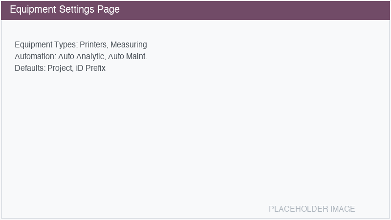

========
Settings
========

Equipment settings are accessible from :menuselection:`Equipment Management --> Settings -->
Configuration` or from :menuselection:`Settings --> Equipment`.

Equipment Types
===============

Enable or disable equipment type sub-modules:

- **Printers**: Install the ``equipment_printer`` module for printer-specific features including
  counter tracking, cartridge management, and paper format support. See :doc:`equipment_printer`.
- **Measuring Devices**: Install the ``equipment_measuring`` module for measuring device features
  including calibration tracking, sensor management, and software/hardware info. See
  :doc:`equipment_measuring`.

.. note::
   Enabling a sub-module will install the corresponding Odoo module. Disabling it will uninstall
   the module (data is preserved).

Automation
==========

Auto-create Analytic Account
----------------------------

When enabled, activating an equipment (changing state from *Draft* to *Active*) automatically
creates a dedicated analytic account for that equipment.

- **Analytic Plan**: Select which analytic plan the auto-created accounts should belong to. The
  default is the *Equipment* plan created during module installation.

This is useful for tracking revenue and costs per equipment without manual setup.

Auto-create Maintenance Equipment
----------------------------------

When enabled, activating an equipment also creates a corresponding ``maintenance.equipment`` record
automatically. If a maintenance equipment with the same serial number already exists, it will be
linked instead of creating a duplicate.

The :guilabel:`Create Maintenance Equipment` button on the form remains available as a manual
alternative when this setting is disabled.

Document Expiry Warning
-----------------------

Configure how many days before a document's expiry date the system should create a warning
activity. The default is **30 days**.

The daily scheduled job checks all active equipment's documents and creates activities for those
within the warning period.

Defaults
========

Default Project
---------------

Set a default project that is automatically assigned to new equipment records. This is useful when
all equipment should be linked to the same ticket/project management system.

Equipment ID Prefix
-------------------

Customize the prefix used for auto-generated Equipment IDs. The default is ``EQ/``, producing
IDs like ``EQ/0001``, ``EQ/0002``, etc.

Changing the prefix affects only newly created equipment — existing IDs are not modified.

.. tip::
   Each company can have its own sequence and prefix. In multi-company setups, configure the
   prefix separately for each company.
